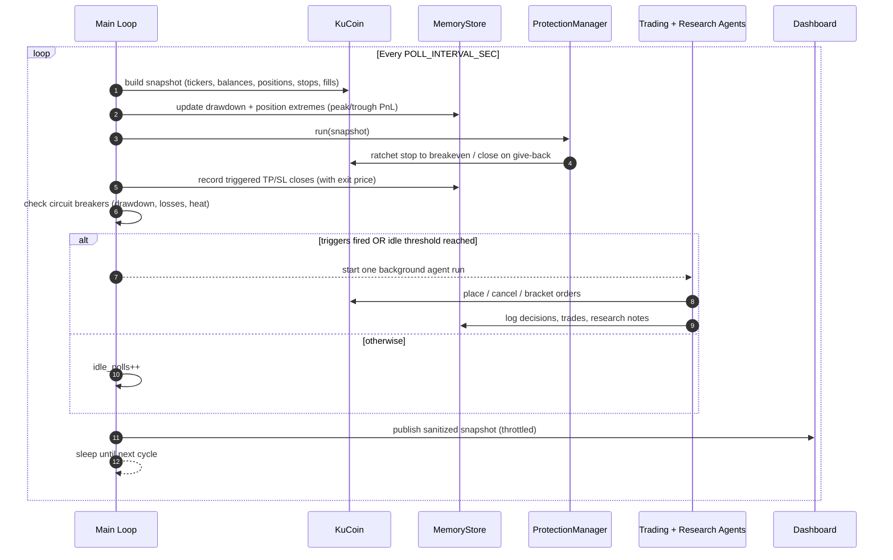
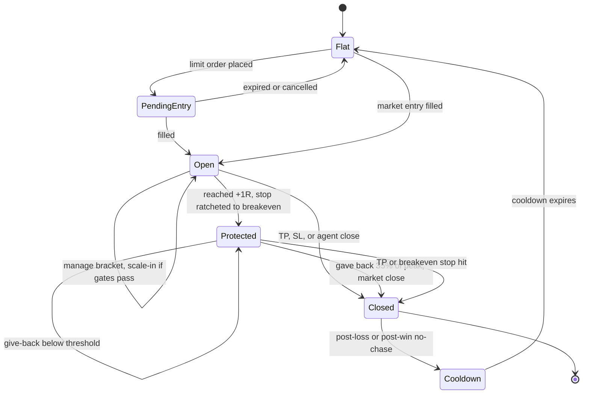
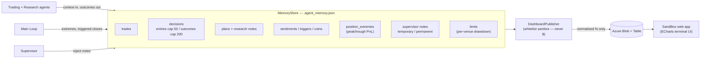

# trAIde

Autonomous multi-agent AI crypto trader powered by Azure OpenAI and KuCoin APIs.

Three specialized agents collaborate in a continuous loop: a **Trading Agent** that executes orders with full risk management, a **Research Agent** that scouts opportunities and market intelligence in parallel, and a **Supervisor Agent** you can talk to via Telegram to monitor and control the system.

## Contents

- [Architecture](#architecture) — five views: components, runtime loop, risk gates, position lifecycle, data flow
- [Features](#features) — technical analysis, risk management, execution, memory, coin universe
- [Setup](#setup)
- [Configuration](#configuration) — all environment variables
- [Telegram Notifications](#telegram-notifications)
- [Supervisor Agent](#supervisor-agent-interactive-telegram-bot)
- [Backtesting](#backtesting)
- [How the Main Loop Works](#how-the-main-loop-works)
- [Project Structure](#project-structure)
- [Running Tests](#running-tests)
- [Deployment](#deployment)

## Architecture

trAIde runs as a single Python process: a continuous **poll loop** drives a **Trading Agent** and a **Research Agent** (both backed by Azure OpenAI), a code-driven **ProtectionManager**, and a sanitized public **dashboard** — while an interactive **Supervisor Agent** lets you steer the system from Telegram. The diagrams below show the same system from five angles.

### System components


**Trading Agent** -- Places bracketed futures limits, manages positions, sets TP/SL, runs multi-timeframe analysis, and explains code-enforced risk decisions. New spot exposure and market entries are disabled; spot tools remain for existing-position protection and closes.

**Research Agent** -- Runs as an explicit, flat-book handoff when research is stale or repeated no-trade runs justify a wider market scan. It owns broad web discovery and logs reusable findings; ordinary position-management runs do not repeat expensive web searches.

**Supervisor Agent** -- Interactive Telegram bot with read access to the entire system. Can query positions, balances, performance, logs, source code, and config. Can inject temporary (one-shot, highest priority) or permanent notes into the Trading Agent's system prompt to influence its behavior.

### Runtime: the poll loop

Every `POLL_INTERVAL_SEC` the loop rebuilds a full account snapshot, runs profit protection, checks circuit breakers, and considers agent invocation when a trigger fires or the idle threshold is reached. The model runs in a single background worker, so slow inference never pauses polling or deterministic protection. Model calls are additionally throttled by book state (`FLAT_AGENT_COOLDOWN_SEC` / `ACTIVE_AGENT_COOLDOWN_SEC`). While flat, price-move magnitude and market breadth automatically shorten the quiet cooldown toward the active cadence.



### Entry decision & risk gates

Every proposed entry runs a fixed gauntlet of code-enforced gates before any order reaches the exchange. Position management (manage / hold / protect / close) bypasses the entry gates. In a hostile (bearish / RSI-exhausted) regime the confidence bar is raised and size shrunk; size also scales down with conviction (how far confidence clears the floor). A confirmed trend-aligned short can pass the anti-FOMO gate, and a daily-aligned entry can break the daily-vs-1h deadlock when a counter-bounce is stalling.


### Position lifecycle & profit protection

Once open, a position is protected in code on every poll: the stop ratchets to breakeven at +1R, and a give-back of the peak run closes it to lock gains — independent of the LLM.



### Memory & dashboard data flow

The local `MemoryStore` is the agent's working memory (auto-pruned by `RETENTION_DAYS`). A whitelist sanitizer publishes a **normalized, dollar-free** projection to Azure, which a separate SandBox web app renders for public spectators.



## Features

### Technical Analysis
- **12+ indicators**: EMA (fast/slow), MACD (line/signal/histogram), RSI, ATR, Bollinger Bands (with BBW%), Stochastic %K/%D, VWAP, ADX, Plus/Minus DI
- **4 timeframes**: 1D (regime gate), 4H (40% weight), 1H (35%), 15m (25%) with weighted directional scoring, daily trend gate, and timeframe conflict detection
- **Market regime detection**: Trending (ADX > 25), Ranging (ADX < 20), Squeeze (BBW < 2% + low ADX) -- each with confidence scores
- **Volume profile**: Point of Control (POC), Value Area High/Low (VAH/VAL) for support/resistance levels
- **OI-price divergence**: Classifies open interest vs price movement (strong trend, short covering, aggressive shorts, long capitulation)
- **Funding rate divergence**: Detects hidden strength/weakness from funding rate misalignment

### Risk Management
- **Circuit breakers**: Auto-restrict to close-only mode when daily drawdown, consecutive losses, or portfolio heat exceed thresholds
- **Optional staged take-profit**: Can split TP into 60%/40% tranches, but defaults off because early realization compresses the admitted reward:risk
- **Kelly criterion sizing**: Quarter-Kelly position sizing from rolling trade performance (requires minimum trade history)
- **Post-loss cooldown**: Blocks new entries on a symbol for a configurable period after a loss
- **Profit-lock (breakeven ratchet + give-back cap)**: Enforced in code every poll, independent of the LLM (`src/protection.py`). Once a position's favorable excursion reaches `PROFIT_LOCK_BREAKEVEN_TRIGGER_R`× its initial risk, the stop is ratcheted to a fee-adjusted breakeven so the trade can no longer turn into a loss. If price then gives back ≥ `PROFIT_LOCK_GIVEBACK_PCT` of its peak run, the position is market-closed (reduce-only) to lock the remaining gain. Stops a profitable trade from round-tripping into a loss when the agent fails to tighten protection itself. Set `PROFIT_LOCK_DRY_RUN=true` to log intended actions without placing orders.
- **Trend-adaptive exits** (`PROFIT_LOCK_TREND_ADAPTIVE`): the tight defaults above are a mean-reversion harness — they shook the bot out of exactly the high-ATR *trends* it correctly identified (ZEC ran +354%/mo yet netted a loss across 8 lifecycles, cutting winners at fee-scale). A trade whose peak run reaches `PROFIT_LOCK_TREND_RUNNER_R`× its **own** risk is a *revealed* trend winner — its own behavior proves the trend, so no external regime feed is needed. For such runners the give-back cap arms later (`PROFIT_LOCK_TREND_GIVEBACK_ARM_R`) and tolerates a deeper pullback (`PROFIT_LOCK_TREND_GIVEBACK_PCT`, default 0.55) so a normal trend breather no longer books a small win and misses the rest of the move. Chop (a trade that never ran far) keeps the tight give-back.
- **No-chase after a win**: Blocks re-entering the *same direction* at a *worse* price than a recent winning exit (within `POST_WIN_COOLDOWN_MINUTES`). Stops the "take profit, then immediately re-buy the top" pattern; a genuine pullback (better price than the exit) is still allowed.
- **Regime throttle**: In a hostile regime (bearish or RSI-exhausted daily) the confidence bar is raised (`REGIME_CAUTION_MIN_CONFIDENCE`) and position size shrunk (`REGIME_CAUTION_SIZE_FACTOR`), so the bot trades less and more selectively instead of churning low-conviction bounce-scalps in a downtrend.
- **Conviction-scaled sizing**: Position size scales with how far the entry's confidence clears the (regime-adjusted) floor — a trade that barely clears it gets `CONVICTION_MIN_SIZE_FACTOR` of full size, ramping linearly to full size at `CONVICTION_FULL_CONFIDENCE`. Targets the failure mode where the agent takes a *full-size* position on a setup it itself reads as "mixed / low-conviction" (the pattern behind the SOL drawdown); only ever shrinks, never enlarges.
- **Sizing coherence (soft factors combine by their worst signal, not by a product)**: The soft size multipliers — regime, conviction, relative-strength, loss-streak, and expectancy — used to *compound multiplicatively*, so five independent 0.5–0.6 "be a bit cautious" reads collapsed a 1–2% risk budget to ~0.03–0.05% and every position became fee-dust that couldn't clear round-trip costs even on a win (the account's small-wins / big-losses shape). They are now combined by taking the single **worst** signal (a min), floored at `SIZE_QUALITY_FLOOR` (default 0.5), so a genuine edge is still sized to matter. The hard dollar-risk caps (volatility, `RISK_PER_TRADE_PCT` budget, concentration, portfolio heat) are applied separately and still shrink from there.
- **Marketable entries (fill-rate fix)**: Passive-only limits resting away from price filled only ~21% of the time — in a trend the price never comes back, so the bot systematically missed the winners and only filled when the move failed (adverse selection). A **high-conviction** entry (confidence ≥ `MARKETABLE_ENTRY_MIN_CONFIDENCE`) may now cross the spread up to `MARKETABLE_ENTRY_MAX_DEV_PCT` of price to fill immediately; because it is still a limit order the atomic TP/SL bracket attaches, so a marketable fill is never naked. Lower-conviction entries keep the passive, min-deviation discipline (rest on a real pullback/rally).
- **Lifecycle risk + concentration caps**: Every add-on shares the original position's stop-defined risk and projected same-symbol exposure budgets. Caps are reapplied after contract-lot rounding; an exchange minimum that exceeds either budget is rejected. Add-ons require a live fee-adjusted breakeven stop and may never loosen it or average down.
- **Correlation gate + relative-strength exception**: Blocks ordinary non-major alt longs while BTC's daily regime is bearish. A rotating leader may pass only when its 1D/4H/1H/15M trends are all bullish, strength is high, and confidence clears `RELATIVE_STRENGTH_MIN_CONFIDENCE`; it is then reduced by `RELATIVE_STRENGTH_SIZE_FACTOR`. No symbol is hardcoded.
- **New-listing guard**: Blocks futures entries on contracts younger than `MIN_FUTURES_LISTING_AGE_DAYS` (via the contract's first-open date). Freshly-listed perps are thin and ultra-volatile — RE-USDT had a ~100% intraday range on day one.
- **Minimum reward:risk (futures)**: Rejects any futures entry whose **post-cost** reward:risk is below `MIN_FUTURES_RR`, including estimated entry/exit fees and slippage. Dollar risk is controlled by position size, not by widening the stop or inventing a farther target.
- **Adaptive edge controller** (`src/edge.py`): derives risk posture from rolling realized results and automatically relaxes when evidence recovers. Code-enforced actions surfaced in `edgeReport`: (1) **direction/symbol risk scaling** — a sufficiently sampled losing long/short direction or symbol trades at `EDGE_NEGATIVE_EXPECTANCY_SIZE_FACTOR`; (2) **severity-scaled symbol bench** — a repeatedly losing symbol is quarantined for an automatically scaled cooldown; (3) **loss-streak throttle** — consecutive losses reduce all new-entry size. Targets stay structural: weak results reduce capital at risk instead of moving take-profits farther away.
- **Give-back arming at 1R** (`PROFIT_LOCK_GIVEBACK_ARM_R`): the give-back cap only acts once a run has reached this multiple of the trade's *own* initial risk (stop distance) — sub-1R wobble belongs to the original stop. Stops the cap from strangling winners into fee-scale scratch closes while losses ride to the full stop.
- **Trend-aligned shorts**: In a confirmed downtrend the anti-FOMO gate would otherwise force the bot to only ever long oversold bounces. With `TREND_ALIGNED_SHORTS_ENABLED`, a short into an exhausted-bearish daily is permitted **when 1h and 15m both confirm** the downtrend is resuming and confidence clears a higher bar (`TREND_SHORT_MIN_CONFIDENCE`) — letting the bot trade *with* the trend, not only against bounces.
- **Reversal longs**: The daily gate is a *lagging* signal — it reads bearish through the bottom of a move, so the bot is structurally forbidden from catching a reversal (in the Jul 2–5 2026 chop it sat out an +11% ETH bounce, blocked from every long). With `REVERSAL_LONGS_ENABLED`, a long against a bearish daily is permitted **only when 1h and 15m have both turned bullish** and confidence clears a high bar (`REVERSAL_LONG_MIN_CONFIDENCE`, default 0.80) — a confirmed turn, not knife-catching. Majors only (non-major alt longs stay blocked by the correlation gate), and the reward:risk floor still applies to whatever passes.
- **Reversal shorts** (`REVERSAL_SHORTS_ENABLED`): exact mirror — when the regime flips bullish, the daily gate blocks every short even as intraday clearly rolls over (Jul 7–8 2026 pullback: "daily is bullish, shorts blocked" repeating while SOL fell 5%). A short against a bullish daily is permitted only when **1h and 15m have both turned bearish** and confidence ≥ `REVERSAL_SHORT_MIN_CONFIDENCE` (0.80). Same discipline: confirmed turns only, R:R floor/bench/sizing still apply.
- **Anti-FOMO daily-exhaustion block**: Refuses trend-continuation entries (long at bullish-overbought / short at bearish-oversold) when the 1D RSI is at an extreme (≥70 or ≤30). Counter-trend reversal setups remain allowed, and a confirmed trend-aligned short can be re-permitted (see above).
- **Anti-FOMO stacking**: Refuses adds to an existing position — even a profitable one — when the daily is exhausted in the same direction. Stops doubling down at the top/bottom.
- **Volatility soft-gate**: Above `MAX_ATR_PCT_FOR_ENTRY` (default 9%), position size is scaled down *linearly* (`threshold/ATR`, floor 50%) — a wider stop on a high-ATR name already sizes the position down via the risk budget, so the old quadratic penalty double-counted volatility and made the market's strongest movers untradeable at meaningful size exactly when they trended hardest. Above 1.5× the threshold the entry is hard-blocked as a data-quality / price-scale-discontinuity guard.
- **Squeeze-breakout signal**: Structured `squeeze_breakout` field (`long` / `short` / `None`) surfaced in `analyze_market_context`. Fires only on the fresh transition out of a 1h Bollinger squeeze (BBW expanding ≥25% off the floor, ADX>20, price beyond BB band, RSI confirming). Takes the asymmetric upside after coiled-volatility periods; volume ≥1.5× 20-candle average is required confirmation. Anti-FOMO block still wins if daily is exhausted in the same direction.
- **1h alignment requirement**: Blocks new entries and add-ons when the 1h bias opposes the proposed side, regardless of what the daily trend says. The 1h timeframe captures the multi-hour trajectory — when daily EMAs are still bullish but 1h is bearish, the daily uptrend is in correction (not a healthy pullback) and buying bounces gets stopped out repeatedly. Catches the failure mode where 15m briefly turns bullish on a dead-cat bounce while the actual correction is still in progress.
- **Deadlock break**: The daily gate (blocks the counter-trend direction) and the 1h-alignment gate (blocks the daily-aligned direction during a counter-bounce) can together strand the bot flat in both directions in a clean trend. With `DEADLOCK_BREAK_ENABLED`, the *daily-aligned* entry (short in a bearish daily, long in a bullish daily) is allowed past the 1h gate **only when the counter-bounce is stalling** — 15m no longer confirms it — and confidence clears `DEADLOCK_MIN_CONFIDENCE`. Takes the trend-continuation trade instead of standing aside, without knife-catching a live bounce. Disjoint from trend-aligned shorts (which covers the *exhausted*-daily case).
- **Timeframe-conflict gate**: Secondary check on top of 1h alignment — blocks new entries when `analyze_market_context` reports `timeframe_conflict=True` AND the 15m bias opposes the proposed direction. Catches lower-TF disagreement that slips past 1h alignment (e.g., 15m bearish while 1h is neutral). Position management (manage/hold/protect) is unaffected by both gates.
- **Atomic entry bracket** (`ATOMIC_BRACKET_ENABLED`): futures limit entries attach TP/SL via KuCoin's st-orders endpoint, so protection arms with the fill. If the atomic endpoint fails, the entry fails closed; there is no plain/unprotected-order fallback.
- **Live entry lease** (`src/safety.py`): every background run receives revocable order authority. Incomplete account/fill truth, a 20-minute run timeout, or shutdown revokes it. Immediately before an entry, equity, positions, stops, and pending orders are fetched again under a serialized exchange-write lock; any structural change forces re-analysis.
- **Hard unrealized-loss cap**: the polling protection loop closes a futures lifecycle when its unrealized loss exceeds `RISK_PER_TRADE_PCT` of current equity. This is a last-resort guard; gaps, fees, and slippage can still make realized loss larger.
- **Real OI sampling**: OI/price quadrants use timestamped exchange open-interest observations with minimum age/change thresholds. The signal stays neutral without a valid baseline; 24h volume is never substituted for OI direction.
- **Unprotected-position safety net** (`EMERGENCY_SL_PCT`, in `src/protection.py`): every poll, any open futures position found with no protective stop (after a short grace so an attached bracket can appear) gets an emergency SL at `EMERGENCY_SL_PCT` from entry + a TP at `MIN_FUTURES_RR`× that — within ~1 poll, not the next agent run. It's a floor, not the agent's considered bracket; the agent refines it next run. Guarantees no position is ever left naked.
- **Realized-vs-intended R:R reality check**: each close records its MFE/MAE (peak/trough PnL), and the agent's `edgeReport` surfaces `realizedRewardRisk` (avg win ÷ avg loss actually achieved). When it's far below the intended floor, the agent is told the take-profits are set too far to reach and to pull them to the nearest realistic structural target with a tighter stop — so the RR floor passes at a *reachable* scale rather than aiming at targets that never fill.
- **Early invalidation cut** (`EARLY_CUT_*`, in `src/protection.py`): the recorded MFE/MAE shows a clean split — winning trades stay green from entry (near-zero adverse excursion) while losers go against immediately. So a position that (after `EARLY_CUT_GRACE_MIN`) has **never** gone meaningfully green *and* has run `EARLY_CUT_MAE_FRAC` of the way to its stop is closed early rather than riding to the full SL. Because winners work fast, this rarely touches one; it surgically shrinks the loss on trades that "never worked" — attacking the avg-loss > avg-win asymmetry. Disjoint from the give-back/breakeven guards (which only act once a trade has gone green).
- **Mandatory TP/SL**: Every position must have stop-loss and take-profit (no naked positions)
- **ATR-based stops**: Stop distance computed from Average True Range for volatility-adaptive risk
- **Daily trade limits**: Per-symbol and total daily trade caps
- **Fee-aware profit targets**: Minimum net profit and ROI thresholds after accounting for fees and slippage

### Order Execution
- **Futures-only new exposure**: New positions use non-marketable `place_futures_limit_order` requests with atomic TP/SL. Spot and futures market orders are close/emergency-only; existing spot holdings can still be protected or closed.
- **Target-price limit entries**: Futures entries wait at a technically derived level (EMA, Bollinger Band, swing high/low, VWAP, Fibonacci), preventing shorting into a dump or buying into a pump.
- **Pending order safety**: Every run includes pending orders; code permits only one futures entry per symbol per run/book, tags bot-created GTC entries, and automatically cancels tagged entries older than `ENTRY_LIMIT_EXPIRY_MINUTES`. Manual and protective orders are never auto-cancelled.
- **Fee-aware entry gate**: Atomic limit entries must clear configured net-profit/ROI floors after estimated fees and slippage.
- **Leverage control**: Configurable max leverage (up to 125x) with automatic margin mode management
- **Fund transfers**: Move USDT between spot, futures, and financial/Earn accounts

### Memory & Learning
- **Trade memory**: Records all trades, decisions, plans, sentiments, triggers, and fee snapshots
- **Persistent event inbox**: Fill and close payloads survive restarts and model failures. They are acknowledged only after a successful agent run, eliminating repeated poll-triggered runs without silently dropping unprocessed events.
- **Two-tier decision retention**: realized closed-trade outcomes (those with a PnL) are kept far longer (cap 200) than routine entry/decline decisions (cap 50), so win/loss history — and the exit prices the no-chase guard relies on — is never crowded out by no-trade decisions
- **Performance tracking**: Win rate, PnL, trade counts split by venue (spot/futures) and mode (paper/live)
- **Position extremes**: Tracks peak and trough unrealized PnL during position lifetime for post-trade analysis
- **Drawdown tracking**: Per-venue daily drawdown percentage
- **Adaptive sizing**: Kelly fraction adjusts position size based on actual win rate and profit/loss ratio
- **Automatic retention**: Items older than configurable retention period are pruned

### Coin Universe Management
- **Market screener** (`scan_futures_market`): the Research and Trading agents can screen the **entire** KuCoin USDT-perp universe (~500 contracts) ranked by momentum / gainers / losers / volume, instead of only looking at coins already on the list. Every result pre-clears the liquidity floor (`SCREENER_MIN_TURNOVER_USD_24H`) and the minimum listing age, so discovery stays liquid and mature (no fresh micro-caps). This closes the gap where the scout could only evaluate symbols it already knew by name and never discovered the coin that was actually moving. Entry gates (daily/1h/R:R/correlation) still apply at trade time.
- Seed with `COINS` env var; agent can dynamically add/remove coins with reasons and exit plans when `FLEXIBLE_COINS_ENABLED=true`
- Auto-discovers unlisted holdings in spot account (worth >= $0.50) and adds them to the active list
- Removes coins after 3 consecutive ticker fetch failures (flexible mode only)
- **Forced research handoff**: after `RESEARCH_HANDOFF_AFTER_NO_TRADE_RUNS` consecutive no-trade runs (stuck / declining), the Trading Agent is forced to hand off to the Research Agent to overhaul the coin list and surface fresh opportunities — rate-limited by `RESEARCH_HANDOFF_COOLDOWN_MIN` so the costly web-research sweep can't fire every cycle

## Setup

1. Copy `.env.example` to `.env` and fill in credentials
2. Install dependencies and run:

```bash
python -m venv .venv
source .venv/bin/activate  # or .venv\Scripts\activate on Windows
pip install -r requirements.txt
python -m src.main
```

The agent runs in a continuous loop: polls KuCoin, tracks price changes, performs web searches for market context, and invokes the AI agents when triggers fire. Keep `PAPER_TRADING=true` while testing.

## Configuration

### Required

| Variable | Description |
|----------|-------------|
| `AZURE_OPENAI_ENDPOINT` | Azure OpenAI resource endpoint |
| `AZURE_OPENAI_API_KEY` | Azure OpenAI API key |
| `KUCOIN_API_KEY` | KuCoin API key |
| `KUCOIN_API_SECRET` | KuCoin API secret |
| `KUCOIN_API_PASSPHRASE` | KuCoin API passphrase |
| `COINS` | Comma-separated symbols (e.g., `BTC-USDT,ETH-USDT,SOL-USDT`) |

### Trading Controls

| Variable | Default | Description |
|----------|---------|-------------|
| `PAPER_TRADING` | `true` | Simulate orders without real execution |
| `MAX_POSITION_USD` | `500` | Maximum spend per trade |
| `RISK_PER_TRADE_PCT` | `0.02` | Maximum stop-defined risk per trade as a fraction of equity (2%, aggressive); fees, slippage, and gaps can make realized loss higher |
| `SIZE_QUALITY_FLOOR` | `0.5` | Floor for the *combined soft* size factor (regime/conviction/relative-strength/streak/expectancy combined by their worst signal, not multiplied). `1.0` disables all soft shrink |
| `MIN_ENTRY_NOTIONAL_USD` | `0` | Fee-aware floor: bump a sub-floor sized entry up to this notional (still bounded by risk/concentration/heat caps). `0` = off (pure risk-budget sizing) |
| `MIN_CONFIDENCE` | `0.65` | Minimum confidence score (0-1) to place a trade |
| `MAX_LEVERAGE` | `3` | Maximum futures leverage (1-125) |
| `MAX_TRADES_PER_SYMBOL_PER_DAY` | `6` | Daily trade cap per symbol (curbs fee churn and loss streaks) |
| `MIN_NET_PROFIT_USD` | `0.50` | Minimum net profit target after fees |
| `MIN_PROFIT_ROI_PCT` | `0.008` | Minimum ROI target (0.8%) after fees |
| `ESTIMATED_SLIPPAGE_PCT` | `0.001` | Estimated slippage (0.1%) for profit calculations |
| `RANGE_TRADING_ENABLED` | `true` | Enable mean-reversion in ranging/sideways markets |
| `SENTIMENT_FILTER_ENABLED` | `false` | Require positive sentiment before trading |
| `SENTIMENT_MIN_SCORE` | `0.55` | Minimum sentiment score (0-1) when filter enabled |

### Advanced Trading Features

| Variable | Default | Description |
|----------|---------|-------------|
| `PARTIAL_TP_ENABLED` | `false` | Opt in to 60%/40% staged take-profit; off by default because the current staging geometry reduces realized reward:risk |
| `KELLY_SIZING_ENABLED` | `true` | Use Kelly criterion for adaptive position sizing |
| `KELLY_MIN_TRADES` | `30` | Minimum trade history before Kelly sizing activates |
| `PREFER_LIMIT_ORDERS` | `true` | Legacy spot-entry preference; new spot exposure is currently disabled |
| `LIMIT_ORDER_TIMEOUT_SEC` | `20` | Timeout before falling back to market order (fee-saving path) |
| `ENTRY_LIMIT_EXPIRY_MINUTES` | `15` | Cancel unfilled target-price entry limit orders after this many minutes (recycles unfilled passive limits faster) |
| `MIN_ENTRY_DEVIATION_PCT` | `0.0005` | Minimum distance (0.05%) from current price for a *low-conviction* resting limit; high-conviction entries use the marketable band instead |
| `MARKETABLE_ENTRY_MAX_DEV_PCT` | `0.0015` | Max fraction of price a high-conviction entry may cross the spread to fill immediately (still bracketed). `0` disables (passive-only) |
| `MARKETABLE_ENTRY_MIN_CONFIDENCE` | `0.75` | Confidence bar to permit a marketable (crossing) entry |
| `MAX_ATR_PCT_FOR_ENTRY` | `9` | Soft volatility gate: above this daily ATR %, position size is scaled down *linearly* (`threshold/ATR`, floor 50%). Above 1.5× this value (13.5% default), entry is hard-blocked as a data-quality guard. |
| `MAX_24H_VOLATILITY_PCT` | `30` | Exclude/hard-block contracts whose absolute 24h price change exceeds this % (separate from ATR gate) |
| `POST_LOSS_COOLDOWN_MINUTES` | `30` | Block new entries on a symbol after a loss |
| `MIN_TRADE_INTERVAL_MINUTES` | `10` | Minimum interval between trades on the same symbol (anti-overtrading) |

### Circuit Breakers

| Variable | Default | Description |
|----------|---------|-------------|
| `CB_MAX_DAILY_DRAWDOWN_PCT` | `3.0` | Restrict new exposure at a 3R daily drawdown with the default 1% lifecycle risk |
| `CB_MAX_CONSECUTIVE_LOSSES` | `3` | Restrict trading after N consecutive losses |
| `CB_MAX_PORTFOLIO_HEAT_PCT` | `6.0` | Maximum total capital at risk % across open positions (the "6% rule") |
| `CB_COOLDOWN_MINUTES` | `120` | Cooldown duration after consecutive loss trigger |

When a circuit breaker fires, the agent enters close-only mode: it can adjust stops, close positions, and manage risk, but cannot open new positions. A Telegram notification is sent.

### Profit Protection

Code-driven guards enforced outside the LLM (`src/protection.py`). They run every poll regardless of whether the agent runs, so a profitable trade can't quietly round-trip into a loss while the agent is idle.

| Variable | Default | Description |
|----------|---------|-------------|
| `PROFIT_LOCK_ENABLED` | `true` | Enable the breakeven ratchet + give-back cap |
| `PROFIT_LOCK_DRY_RUN` | `false` | Log intended actions without placing orders (observe before arming on live funds) |
| `PROFIT_LOCK_BREAKEVEN_TRIGGER_R` | `1.0` | Move the stop to breakeven once favorable excursion reaches this multiple of initial risk (≥1R is the consensus floor; paired here with partial-TP + the give-back trail) |
| `PROFIT_LOCK_BREAKEVEN_FEE_PCT` | `0.0015` | Round-trip cost buffer (KuCoin futures taker 0.06%×2 + slippage) so the breakeven stop nets ≥0 |
| `PROFIT_LOCK_GIVEBACK_PCT` | `0.35` | Close after price retraces this fraction of the peak run; `0.35` retains ~65% of peak profit, mid-band of the 60–70% best-practice range (`0` disables the give-back close) |
| `PROFIT_LOCK_MIN_FE_PCT` | `0.005` | Minimum run (fraction of entry) before the give-back cap can act — filters noise |
| `PROFIT_LOCK_GIVEBACK_ARM_R` | `1.0` | Also require the run to reach this multiple of the trade's own risk (stop distance) before give-back can act; `0` = pct-arming only |
| `EARLY_CUT_ENABLED` | `true` | Cut a trade that never went green and is failing toward its stop, before the full SL |
| `EARLY_CUT_GRACE_MIN` | `20` | Minutes to let a fresh entry work before early-cut can act |
| `EARLY_CUT_MIN_FAVORABLE_PCT` | `0.003` | Peak excursion (fraction of entry) below which a trade "never worked" |
| `EARLY_CUT_MAE_FRAC` | `0.6` | Fraction of the way to the stop that triggers the early cut |
| `PROFIT_LOCK_TREND_ADAPTIVE` | `true` | Loosen the give-back cap for a *revealed* trend winner so it can run (chop keeps the tight defaults) |
| `PROFIT_LOCK_TREND_RUNNER_R` | `2.0` | Peak run (in R, the trade's own risk) at which a position is treated as a trend winner |
| `PROFIT_LOCK_TREND_GIVEBACK_PCT` | `0.55` | Once a runner, tolerate giving back this much of peak (vs `PROFIT_LOCK_GIVEBACK_PCT` in chop) |
| `PROFIT_LOCK_TREND_GIVEBACK_ARM_R` | `2.5` | Arm the loosened give-back only after this much favorable run |
| `NO_CHASE_ENABLED` | `true` | Block same-direction re-entry at a worse price after a recent winning close |
| `POST_WIN_COOLDOWN_MINUTES` | `45` | Window after a winning close during which re-entry at a worse price is blocked |
| `NO_CHASE_BUFFER_PCT` | `0.001` | Tolerance band around the prior exit price |
| `ATOMIC_BRACKET_ENABLED` | `true` | Attach TP/SL to the futures entry order (KuCoin st-orders) so a limit fill is protected instantly, not on the next agent run |
| `EMERGENCY_SL_PCT` | `0.02` | Safety net: SL distance (fraction of entry) for an open position found with no stop; TP set at `MIN_FUTURES_RR`× it. `0` disables |

Every automatic action (stop moved to breakeven, position closed, or a dry-run preview) is logged and sent as a Telegram alert.

### Risk Guardrails

Blast-radius and selection guards added after the RE-USDT concentration blowup (one freshly-listed micro-cap alt at ~74% of equity, longed into a BTC downtrend).

| Variable | Default | Description |
|----------|---------|-------------|
| `MAX_POSITION_EQUITY_PCT` | `0.5` | Cap a single position's notional at this fraction of total equity, regardless of leverage (`0` = off) |
| `MIN_FUTURES_LISTING_AGE_DAYS` | `7` | Block futures entries on contracts younger than this many days — thin/volatile fresh listings (`0` = off) |
| `MIN_FUTURES_RR` | `1.5` | Reject futures entries whose post-cost reward:risk (fees and estimated slippage included) is below this (`0` = off) |
| `SCREENER_MIN_TURNOVER_USD_24H` | `5000000` | Market screener (`scan_futures_market`) liquidity floor: only surface perps with at least this 24h USDT turnover |

### Adaptive Edge Controller

Self-tuning risk (`src/edge.py`): posture derives from rolling realized closes, tightens while losing, and relaxes automatically when expectancy recovers. Once attributed history is sufficient it uses realized R (net PnL / planned maximum loss), so larger notionals cannot dominate the learning signal; legacy dollar PnL is only a migration fallback. The live RR gate remains structural and cost-aware, while the controller adapts risk rather than stretching targets.

| Variable | Default | Description |
|----------|---------|-------------|
| `ADAPTIVE_EDGE_ENABLED` | `true` | Master switch for the adaptive edge controller |
| `EDGE_LOOKBACK_TRADES` | `30` | Rolling window of realized closes the stats are computed over |
| `EDGE_MIN_TRADES` | `8` | Minimum closes before adaptive actions kick in (below this, static behavior) |
| `EDGE_DIRECTION_MIN_TRADES` | `5` | Minimum closes before a long/short direction or symbol's expectancy can reduce its risk |
| `EDGE_NEGATIVE_EXPECTANCY_SIZE_FACTOR` | `0.5` | Entry-size multiplier for a sufficiently sampled losing direction/symbol; never enlarges risk |
| `EDGE_RR_STEP`, `EDGE_RR_CAP`, `EDGE_RR_STALE_HOURS`, `EDGE_SYMBOL_RR_MIN_TRADES` | legacy | Retained for configuration compatibility and offline comparisons; live admission no longer stretches targets after losses |
| `EDGE_BENCH_LOOKBACK` | `5` | Per-symbol recent closes examined for the bench |
| `EDGE_BENCH_MIN_LOSSES` | `3` | Losses within that window (with negative net) that bench the symbol |
| `EDGE_BENCH_COOLDOWN_HOURS` | `12` | Base bench rest; scaled by loss count so a persistent loser sits out longer |
| `EDGE_BENCH_COOLDOWN_MAX_MULT` | `4` | Cap on the bench-rest scaling (e.g. 12h × 4 = up to 48h) |
| `EDGE_STREAK_THRESHOLD` | `2` | Consecutive realized losses that trigger the size throttle |
| `EDGE_STREAK_SIZE_FACTOR` | `0.5` | Entry-size multiplier while on a losing streak |
| `ALT_LONG_BLOCK_WHEN_BTC_BEARISH` | `true` | Block longs on non-major alts while BTC's daily regime is bearish (alts are high-beta to BTC) |
| `ALT_MAJORS` | `BTC,ETH` | Symbols exempt from the alt-long gate (they have their own per-symbol daily gate) |
| `RELATIVE_STRENGTH_LONGS_ENABLED` | `true` | Allow a narrow all-timeframe bullish exception to the bearish-BTC alt veto |
| `RELATIVE_STRENGTH_MIN_CONFIDENCE` | `0.82` | Confidence required for that exception |
| `RELATIVE_STRENGTH_SIZE_FACTOR` | `0.5` | Reduced size applied to an exception trade |
| `RESEARCH_HANDOFF_AFTER_NO_TRADE_RUNS` | `3` | Force a Research handoff after this many consecutive no-trade runs to refresh the coin list (`0` = off) |
| `RESEARCH_HANDOFF_COOLDOWN_MIN` | `30` | Minimum minutes between forced Research handoffs — rate-limits the costly web sweep (`0` = off) |

### Regime-Aware Entries

Code-enforced entry adjustments that work alongside the daily gate (`src/regime.py`): be more selective in hostile regimes, size by conviction, trade *with* a confirmed downtrend instead of only longing bounces, and break the daily-vs-1h gate deadlock.

| Variable | Default | Description |
|----------|---------|-------------|
| `REGIME_THROTTLE_ENABLED` | `true` | Raise the confidence bar + shrink size in a hostile (bearish / RSI-exhausted) daily |
| `REGIME_CAUTION_MIN_CONFIDENCE` | `0.75` | Elevated confidence floor in a hostile regime (base is `MIN_CONFIDENCE`) |
| `REGIME_CAUTION_SIZE_FACTOR` | `0.6` | Position-size multiplier applied in a hostile regime |
| `TREND_ALIGNED_SHORTS_ENABLED` | `true` | Permit a trend-aligned short past the anti-FOMO gate in an exhausted-bearish daily |
| `TREND_SHORT_MIN_CONFIDENCE` | `0.78` | Higher confidence bar specifically for a counter-bounce short |
| `TREND_SHORT_REQUIRE_15M` | `true` | Require 15m (not just 1h) bearish confirmation before allowing the short |
| `REVERSAL_LONGS_ENABLED` | `true` | Allow a long past a bearish daily gate when 1h+15m have both turned bullish (catch confirmed reversals) |
| `REVERSAL_LONG_MIN_CONFIDENCE` | `0.80` | High confidence bar for a counter-daily reversal long |
| `REVERSAL_LONG_REQUIRE_15M` | `true` | Require 15m (not just 1h) bullish confirmation before allowing the reversal long |
| `REVERSAL_SHORTS_ENABLED` | `true` | Mirror: allow a short past a bullish daily gate when 1h+15m have both turned bearish |
| `REVERSAL_SHORT_MIN_CONFIDENCE` | `0.80` | High confidence bar for a counter-daily reversal short |
| `REVERSAL_SHORT_REQUIRE_15M` | `true` | Require 15m (not just 1h) bearish confirmation before allowing the reversal short |
| `CONVICTION_SIZING_ENABLED` | `true` | Scale position size by how far confidence clears the floor (low-conviction → smaller) |
| `CONVICTION_FULL_CONFIDENCE` | `0.85` | Confidence at/above which full size is used (linear ramp from the floor) |
| `CONVICTION_MIN_SIZE_FACTOR` | `0.5` | Size multiplier at the confidence floor |
| `DEADLOCK_BREAK_ENABLED` | `true` | Allow the daily-aligned entry past the 1h gate when a 1h counter-bounce is stalling (15m no longer confirms it) |
| `DEADLOCK_MIN_CONFIDENCE` | `0.72` | Raised confidence bar to take the trend-continuation entry |

### Loop & Polling

| Variable | Default | Description |
|----------|---------|-------------|
| `POLL_INTERVAL_SEC` | `60` | Seconds between polling cycles |
| `PRICE_CHANGE_TRIGGER_PCT` | `0.5` | Price move % that triggers an agent run |
| `MAX_IDLE_POLLS` | `10` | Force agent run after N idle polls |
| `FLAT_AGENT_COOLDOWN_SEC` | `600` | Quiet-market HUNT cadence while flat (~10min); triggered move magnitude/breadth automatically reduce it toward the active cadence |
| `FLAT_BACKOFF_MAX_MULTIPLIER` | `1` | Power-of-two backoff cap for repeated idle-only no-action runs; `1` disables backoff (frequent hunting), `>1` opts in |
| `ACTIVE_AGENT_COOLDOWN_SEC` | `300` | Minimum interval between model runs with exposed capital or a recent lifecycle/trigger event |
| `AGENT_MAX_TURNS` | `20` | Max tool-call turns per run; a separate 20-minute wall-clock timeout revokes order authority |

### KuCoin

| Variable | Default | Description |
|----------|---------|-------------|
| `KUCOIN_BASE_URL` | `https://api.kucoin.com` | Spot API endpoint |
| `KUCOIN_FUTURES_ENABLED` | `true` | Enable futures trading |
| `KUCOIN_FUTURES_BASE_URL` | `https://api-futures.kucoin.com` | Futures API endpoint |
| `KUCOIN_FUTURES_MARGIN_MODE` | `cross` | Futures margin mode (`cross` / `isolated` / `auto`); the cross-leverage call is only issued in cross mode |
| `FLEXIBLE_COINS_ENABLED` | `true` | Allow agent to add/remove coins dynamically |

### Azure APIM (Optional)

If `AZURE_APIM_OPENAI_SUBSCRIPTION_KEY` is set, the client uses APIM endpoint/deployment instead of direct Azure OpenAI (subscription key auth).

| Variable | Description |
|----------|-------------|
| `AZURE_APIM_OPENAI_ENDPOINT` | APIM gateway endpoint |
| `AZURE_APIM_OPENAI_DEPLOYMENT` | Deployment name behind APIM |
| `AZURE_APIM_OPENAI_API_VERSION` | API version (default: `2024-08-01-preview`) |
| `AZURE_APIM_OPENAI_SUBSCRIPTION_KEY` | APIM subscription key |

### Memory

| Variable | Default | Description |
|----------|---------|-------------|
| `MEMORY_FILE` | `.agent_memory.json` | Path to agent memory store |
| `RETENTION_DAYS` | `90` | Auto-prune items older than this; both main loop and agent use the same horizon |

### Tracing (Optional)

| Variable | Default | Description |
|----------|---------|-------------|
| `ENABLE_TRACING` | `false` | Enable OpenAI Agents SDK spans |
| `ENABLE_CONSOLE_TRACING` | `false` | Print spans to console (dev only) |
| `OPENAI_TRACE_API_KEY` | — | Export spans to OpenAI traces endpoint |
| `LANGSMITH_ENABLED` | `false` | Enable LangSmith tracing |
| `LANGSMITH_API_KEY` | — | LangSmith API key |
| `LANGSMITH_PROJECT` | `trAIde` | LangSmith project name |
| `LANGSMITH_API_URL` | `https://api.smith.langchain.com` | LangSmith API endpoint |
| `LANGSMITH_TRACING` | `true` | Send agent runs to LangSmith when enabled |
| `LANGSMITH_SAMPLE_RATE` | `0.1` | Head-sampling fraction of runs traced to LangSmith (avoids the monthly unique-trace cap) |

OTLP export for Azure Monitor is supported via `OTEL_EXPORTER_OTLP_ENDPOINT` and `OTEL_EXPORTER_OTLP_HEADERS`.

## Telegram Notifications

Get real-time updates on your phone for every trading decision, order execution, and error.

### 1. Create a Telegram bot
1. Open Telegram and search for **@BotFather**.
2. Send `/newbot` and follow the prompts to choose a name and username.
3. BotFather replies with your **bot token** (e.g., `123456:ABC-DEF1234...`). Save it.

### 2. Get your chat ID
1. Start a conversation with your new bot (search its username and press **Start**).
2. Send any message to the bot (e.g., "hello").
3. Open this URL in your browser (replace `<BOT_TOKEN>` with your token):
   ```
   https://api.telegram.org/bot<BOT_TOKEN>/getUpdates
   ```
4. In the JSON response, find `"chat":{"id":123456789}` -- that number is your **chat ID**.

### 3. Configure `.env`
```env
TELEGRAM_ENABLED=true
TELEGRAM_BOT_TOKEN=123456:ABC-DEF1234ghIkl-zyx57W2v1u123ew11
TELEGRAM_CHAT_ID=123456789
TELEGRAM_SILENT=false
```

| Variable | Description |
|----------|-------------|
| `TELEGRAM_ENABLED` | `true` to activate notifications, `false` to disable (default: `false`) |
| `TELEGRAM_BOT_TOKEN` | Bot token from @BotFather |
| `TELEGRAM_CHAT_ID` | Your personal or group chat ID |
| `TELEGRAM_SILENT` | `true` to send notifications without sound (default: `false`) |

### What you'll receive
- **Startup** -- bot mode (live/paper), active coins, max position, leverage, futures status
- **Agent run summaries** -- triggers that fired, every order placed (symbol, side, price, TP/SL, RR ratio, paper/live), declines with reason and confidence, and a narrative excerpt
- **Order details** -- full breakdown of each executed order including stop-loss, take-profit, expected PnL for sells, and order ID
- **Circuit breaker alerts** -- immediate notification when trading is restricted
- **Errors** -- immediate alerts when the agent run or snapshot build fails

Messages are sent asynchronously via a background thread and never block the trading loop. If Telegram is unreachable, failures are logged and silently skipped.

## Supervisor Agent (Interactive Telegram Bot)

Talk back to the bot. The Supervisor Agent listens for your Telegram messages, processes them through an AI agent with full read access to the system, and replies in the same chat.

### What it can do
- **Query status** -- ask about positions, balances, performance, win rate, recent trades, or recent decisions. It fetches live data from KuCoin and agent memory.
- **Read & search logs** -- ask it to check logs for errors, search for a specific symbol, or show the last N lines.
- **Read source code** -- inspect any file in the `src/` directory.
- **View configuration** -- see all non-secret config values (API keys are never exposed).
- **Fetch market data** -- funding rates, open interest, mark price for futures symbols.
- **Web search** -- search the web for market context, news, or any other information.
- **Write notes for the trading agent** -- influence the trading agent's behavior:
  - **Temporary notes** (one-time, highest priority): injected into the trading agent's system prompt on the next run only, then auto-deleted. These override any conflicting rules. Example: "Close all BTC positions immediately."
  - **Permanent notes**: added to the trading agent's system prompt on every run until manually deleted. Example: "Never trade DOGE-USDT."
- **Conversation memory** -- the supervisor remembers the last 3 exchanges and maintains a rolling summary of older conversations, so you can have multi-turn dialogues without repeating context.

### Enable it
```env
SUPERVISOR_ENABLED=true
TELEGRAM_ENABLED=true
TELEGRAM_BOT_TOKEN=...
TELEGRAM_CHAT_ID=...
```

| Variable | Description |
|----------|-------------|
| `SUPERVISOR_ENABLED` | `true` to start the interactive bot (default: `false`) |
| `LOG_FILE` | Log file path the supervisor reads (default: `traide.log`) |
| `LOG_MAX_BYTES` | Max log file size before rotation (default: `5242880` / 5MB) |
| `LOG_BACKUP_COUNT` | Number of rotated log backups (default: `3`) |

The supervisor runs as a daemon thread alongside the trading loop, using Telegram long-polling. Only messages from the configured `TELEGRAM_CHAT_ID` are processed; all others are silently ignored.

### Example commands
- "What's my current P&L?"
- "Show me the last 5 trades"
- "Search logs for ERROR"
- "Add a temporary note: skip all trades this run, market is too volatile"
- "Add a permanent note: always check BTC dominance before trading altcoins"
- "List all notes"
- "Delete permanent note 0"
- "What's the current config?"
- "Show me my KuCoin balances"
- "What's the funding rate for XBTUSDTM?"

## Backtesting

Run strategy backtests on historical data with parameter sweeps.

```bash
python -m src.backtest --symbol BTC-USDT --interval 1hour --lookback_hours 240 \
  --buy_rsi 55 --stop_atr_mult 1.5 --target_atr_mult 2.0 --fee 0.001
```

The backtester uses EMA crossover + RSI + MACD histogram for entries, ATR-based stops and targets, and computes total return %, win rate, profit factor, max drawdown, and best/worst trade. A parameter sweep mode scans ranges of `buy_rsi`, `stop_atr_mult`, `target_atr_mult`, and `min_macd_hist` to find optimal combinations.

## How the Main Loop Works

Each polling cycle (`POLL_INTERVAL_SEC` seconds):

1. **Snapshot** -- Fetches tickers, spot/futures/financial balances, open positions, stop orders, pending limit orders, recent fills, closed positions, and fee rates from KuCoin
2. **Reconciliation** -- Sums USDT across all accounts, tracks daily drawdown per venue
3. **Price detection** -- Compares prices with the last successful model-reviewed state. Each symbol learns an EWMA of ordinary poll noise and raises its trigger adaptively, bounded at `PRICE_TRIGGER_MAX_MULTIPLIER`× the configured floor (default 2× — safety-biased, so any move ≥ 2× the base trigger always earns a fresh model look even in the noisiest symbol; raise it to save more tokens), preventing oscillation from repeatedly calling the model
4. **Position extremes** -- Updates peak/trough unrealized PnL for open positions
5. **Profit protection** -- Ratchets stops to breakeven and caps give-back on live futures positions (code-driven, independent of the agent)
6. **Event tracking** -- Logs triggered futures TP/SL closes as decisions (with exit price, for the no-chase guard)
7. **Circuit breakers** -- Checks drawdown and consecutive losses against thresholds
8. **Agent run** -- If triggers exist or the idle threshold is reached, starts one non-blocking Trading Agent run. Idle-only no-action cycles back off automatically up to `FLAT_BACKOFF_MAX_MULTIPLIER`; price/fill/risk events stay responsive. A pending atomic entry suppresses idle hunting and is managed by its deterministic lease/expiry instead of model babysitting
9. **Wait** -- Sleeps until next cycle

Trigger types: `initial:SYMBOL` (new unreviewed symbol), `price_move:SYMBOL:X.XX%` (meaningful displacement), `auto_trigger:SYMBOL:above|below:PRICE` (one-shot, expiring explicit level), and `idle_threshold` (scheduled review). Crossed explicit triggers are persisted as pending events before consumption, so a restart cannot lose them. Cadence, productivity, reviewed prices, and learned price noise persist across restarts in `agent_memory.json`; deterministic protection still runs every poll.

Execution-quality metrics count a resting limit entry only when its recorded `clientOid` starts with `traide-entry-`. Market and reduce-only close order IDs are excluded from `limitFillRate`.

## Project Structure

```
src/
  agent.py             Trading + Research agent assembly, system prompts, per-run context & helpers
  tools.py             All 47 agent tools (build_tools), organized by section: spot, futures, market data, screening, planning, news
  analytics.py         Technical indicators, regime detection, volume profile, multi-TF scoring
  backtest.py          Strategy backtester with parameter sweeps
  config.py            Configuration dataclasses, env var loading, validation
  conversation_memory.py  Supervisor conversation memory (rolling summary + recent exchanges)
  kucoin.py            KuCoin spot + futures API client (HMAC auth, retries, error handling)
  main.py              Main trading loop, snapshot building, circuit breakers, trigger detection
  memory.py            Agent memory store (trades, decisions, plans, Kelly, cooldowns)
  protection.py        Code-driven profit guards: breakeven ratchet, give-back cap, no-chase (runs every poll)
  safety.py            Revocable background-run authority and serialized exchange-write lock
  supervisor.py        Supervisor agent tools (read logs, memory, config, write notes)
  telegram.py          Telegram notification sender (async, background thread)
  telegram_bot.py      Telegram long-polling bot for Supervisor Agent
  utils.py             Symbol normalization utilities
  wsgi.py              Gunicorn WSGI shim for service deployment
tests/
  test_analytics.py    Analytics and indicator tests
  test_config.py       Configuration validation tests
  test_conversation_memory.py  Conversation memory tests
  test_memory.py       Memory store tests
  test_protection.py   Profit-lock decision + no-chase guard tests
  test_telegram.py     Telegram notification tests
  test_utils.py        Utility function tests
```

## Running Tests

```bash
python -m pytest tests/ -v
```

## Deployment

### Direct

```bash
python -m src.main
```

### Gunicorn (service-style on Linux)

```bash
gunicorn -w 1 -b 0.0.0.0:8000 'src.wsgi:application'
```

Keep `-w 1` to avoid multiple loops. `http://localhost:8000/` returns a health check while the background trading thread runs.

### systemd

Create `/etc/systemd/system/traide.service`:
```ini
[Unit]
Description=trAIde Trading Agent (Gunicorn)
After=network.target
Wants=network-online.target

[Service]
Type=simple
User=traide
Group=traide
WorkingDirectory=/opt/traide
Environment="PATH=/opt/traide/.venv/bin"
ExecStart=/opt/traide/.venv/bin/gunicorn -w 1 -b 0.0.0.0:8000 'src.wsgi:application'
Restart=always
RestartSec=5

[Install]
WantedBy=multi-user.target
```

```bash
sudo systemctl daemon-reload
sudo systemctl enable traide.service
sudo systemctl start traide.service
```

Logs: `journalctl -u traide.service -f`

### Quick setup script

```bash
sudo SERVICE_USER=$(whoami) ./setup_service.sh
```
or
```bash
sudo bash setup_service.sh
```

Environment overrides: `SERVICE_NAME`, `SERVICE_USER`, `SERVICE_GROUP`, `WORKDIR`, `VENV_PATH`, `BIND_ADDR`.


___

# Disclaimer

This software is for educational purposes only. USE THE SOFTWARE AT YOUR OWN RISK. THE AUTHORS AND ALL AFFILIATES ASSUME NO RESPONSIBILITY FOR YOUR TRADING RESULTS. Do not risk money that you are afraid to lose. There might be bugs in the code - this software DOES NOT come with ANY warranty.
