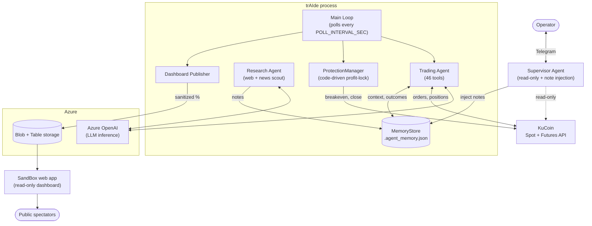
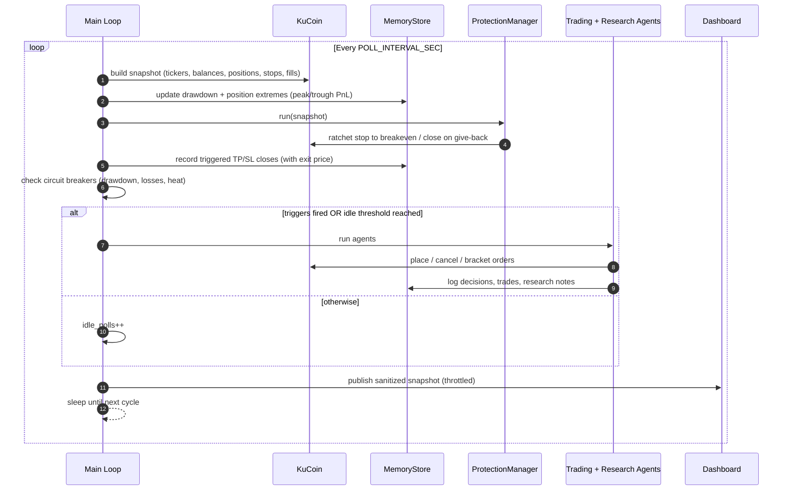
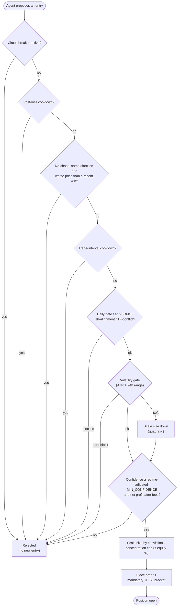
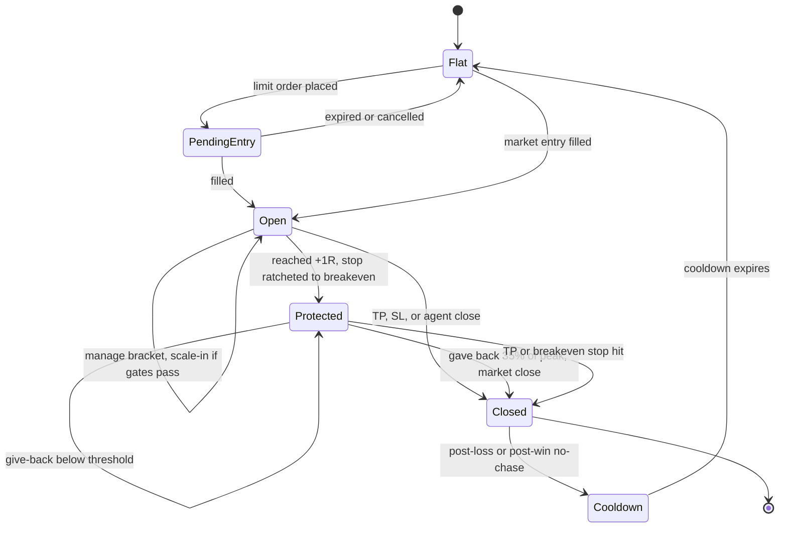
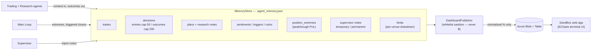

# trAIde

Autonomous multi-agent AI crypto trader powered by Azure OpenAI and KuCoin APIs.

Three specialized agents collaborate in a continuous loop: a **Trading Agent** that executes orders with full risk management, a **Research Agent** that scouts opportunities and market intelligence in parallel, and a **Supervisor Agent** you can talk to via Telegram to monitor and control the system.

## Contents

- [Architecture](#architecture) — five views: components, runtime loop, risk gates, position lifecycle, data flow
- [Features](#features) — technical analysis, risk management, execution, memory, coin universe
- [Setup](#setup)
- [Configuration](#configuration) — all environment variables
- [Telegram Notifications](#telegram-notifications)
- [Supervisor Agent](#supervisor-agent-interactive-telegram-bot)
- [Backtesting](#backtesting)
- [How the Main Loop Works](#how-the-main-loop-works)
- [Project Structure](#project-structure)
- [Running Tests](#running-tests)
- [Deployment](#deployment)

## Architecture

trAIde runs as a single Python process: a continuous **poll loop** drives a **Trading Agent** and a **Research Agent** (both backed by Azure OpenAI), a code-driven **ProtectionManager**, and a sanitized public **dashboard** — while an interactive **Supervisor Agent** lets you steer the system from Telegram. The diagrams below show the same system from five angles.

### System components



**Trading Agent** -- Places orders, manages positions, sets TP/SL, runs multi-timeframe analysis, enforces risk rules. Has 46 tools covering order execution, market analysis, position planning, account management, memory, and coin universe management.

**Research Agent** -- Runs concurrently while the Trading Agent executes. Searches CoinDesk, The Block, Cointelegraph, exchange blogs, X/Twitter, and macro news. Analyzes strategy patterns (missed profits, repeated losses). Logs findings to memory for the Trading Agent to consume.

**Supervisor Agent** -- Interactive Telegram bot with read access to the entire system. Can query positions, balances, performance, logs, source code, and config. Can inject temporary (one-shot, highest priority) or permanent notes into the Trading Agent's system prompt to influence its behavior.

### Runtime: the poll loop

Every `POLL_INTERVAL_SEC` the loop rebuilds a full account snapshot, runs profit protection, checks circuit breakers, and — only when a trigger fires or the idle threshold is reached — invokes the agents.



### Entry decision & risk gates

Every proposed entry runs a fixed gauntlet of code-enforced gates before any order reaches the exchange. Position management (manage / hold / protect / close) bypasses the entry gates. In a hostile (bearish / RSI-exhausted) regime the confidence bar is raised and size shrunk; size also scales down with conviction (how far confidence clears the floor). A confirmed trend-aligned short can pass the anti-FOMO gate, and a daily-aligned entry can break the daily-vs-1h deadlock when a counter-bounce is stalling.



### Position lifecycle & profit protection

Once open, a position is protected in code on every poll: the stop ratchets to breakeven at +1R, and a give-back of the peak run closes it to lock gains — independent of the LLM.



### Memory & dashboard data flow

The local `MemoryStore` is the agent's working memory (auto-pruned by `RETENTION_DAYS`). A whitelist sanitizer publishes a **normalized, dollar-free** projection to Azure, which a separate SandBox web app renders for public spectators.



## Features

### Technical Analysis
- **12+ indicators**: EMA (fast/slow), MACD (line/signal/histogram), RSI, ATR, Bollinger Bands (with BBW%), Stochastic %K/%D, VWAP, ADX, Plus/Minus DI
- **4 timeframes**: 1D (regime gate), 4H (40% weight), 1H (35%), 15m (25%) with weighted directional scoring, daily trend gate, and timeframe conflict detection
- **Market regime detection**: Trending (ADX > 25), Ranging (ADX < 20), Squeeze (BBW < 2% + low ADX) -- each with confidence scores
- **Volume profile**: Point of Control (POC), Value Area High/Low (VAH/VAL) for support/resistance levels
- **OI-price divergence**: Classifies open interest vs price movement (strong trend, short covering, aggressive shorts, long capitulation)
- **Funding rate divergence**: Detects hidden strength/weakness from funding rate misalignment

### Risk Management
- **Circuit breakers**: Auto-restrict to close-only mode when daily drawdown, consecutive losses, or portfolio heat exceed thresholds
- **Staged take-profit**: Splits TP into 2 tranches (60%/40%) to lock in partial gains
- **Kelly criterion sizing**: Quarter-Kelly position sizing from rolling trade performance (requires minimum trade history)
- **Post-loss cooldown**: Blocks new entries on a symbol for a configurable period after a loss
- **Profit-lock (breakeven ratchet + give-back cap)**: Enforced in code every poll, independent of the LLM (`src/protection.py`). Once a position's favorable excursion reaches `PROFIT_LOCK_BREAKEVEN_TRIGGER_R`× its initial risk, the stop is ratcheted to a fee-adjusted breakeven so the trade can no longer turn into a loss. If price then gives back ≥ `PROFIT_LOCK_GIVEBACK_PCT` of its peak run, the position is market-closed (reduce-only) to lock the remaining gain. Stops a profitable trade from round-tripping into a loss when the agent fails to tighten protection itself. Set `PROFIT_LOCK_DRY_RUN=true` to log intended actions without placing orders.
- **No-chase after a win**: Blocks re-entering the *same direction* at a *worse* price than a recent winning exit (within `POST_WIN_COOLDOWN_MINUTES`). Stops the "take profit, then immediately re-buy the top" pattern; a genuine pullback (better price than the exit) is still allowed.
- **Regime throttle**: In a hostile regime (bearish or RSI-exhausted daily) the confidence bar is raised (`REGIME_CAUTION_MIN_CONFIDENCE`) and position size shrunk (`REGIME_CAUTION_SIZE_FACTOR`), so the bot trades less and more selectively instead of churning low-conviction bounce-scalps in a downtrend.
- **Conviction-scaled sizing**: Position size scales with how far the entry's confidence clears the (regime-adjusted) floor — a trade that barely clears it gets `CONVICTION_MIN_SIZE_FACTOR` of full size, ramping linearly to full size at `CONVICTION_FULL_CONFIDENCE`. Targets the failure mode where the agent takes a *full-size* position on a setup it itself reads as "mixed / low-conviction" (the pattern behind the SOL drawdown); only ever shrinks, never enlarges, and is floored by the 30% volatility floor.
- **Concentration cap**: Shrinks any single position's notional to ≤ `MAX_POSITION_EQUITY_PCT` of total equity, regardless of leverage — bounds the per-name blast radius (the RE-USDT blowup was one name at ~74% of the account). Applied after every other size scaler, just before the order is placed.
- **Correlation gate**: Blocks **longs on non-major alts while BTC's daily regime is bearish** (`ALT_LONG_BLOCK_WHEN_BTC_BEARISH`). Alts are high-beta to BTC; longing them into a confirmed BTC downtrend is the exact setup that blew up on RE-USDT. Majors in `ALT_MAJORS` are exempt (they have their own per-symbol daily gate); shorts are never blocked by this gate.
- **New-listing guard**: Blocks futures entries on contracts younger than `MIN_FUTURES_LISTING_AGE_DAYS` (via the contract's first-open date). Freshly-listed perps are thin and ultra-volatile — RE-USDT had a ~100% intraday range on day one.
- **Minimum reward:risk (futures)**: Rejects any futures entry whose take-profit distance is less than `MIN_FUTURES_RR` × the stop-loss distance (checked when both are supplied at entry). Previously the R:R floor existed only on the spot path, so futures brackets were being set with stops *wider* than targets — the direct cause of losses running ~4× the wins at a high win rate. Dollar risk is meant to be controlled by position size, not by widening the stop past the target.
- **Trend-aligned shorts**: In a confirmed downtrend the anti-FOMO gate would otherwise force the bot to only ever long oversold bounces. With `TREND_ALIGNED_SHORTS_ENABLED`, a short into an exhausted-bearish daily is permitted **when 1h and 15m both confirm** the downtrend is resuming and confidence clears a higher bar (`TREND_SHORT_MIN_CONFIDENCE`) — letting the bot trade *with* the trend, not only against bounces.
- **Anti-FOMO daily-exhaustion block**: Refuses trend-continuation entries (long at bullish-overbought / short at bearish-oversold) when the 1D RSI is at an extreme (≥70 or ≤30). Counter-trend reversal setups remain allowed, and a confirmed trend-aligned short can be re-permitted (see above).
- **Anti-FOMO stacking**: Refuses adds to an existing position — even a profitable one — when the daily is exhausted in the same direction. Stops doubling down at the top/bottom.
- **Volatility soft-gate**: Above `MAX_ATR_PCT_FOR_ENTRY`, position size is scaled down quadratically (`(threshold/ATR)²`, floor 30%). Above 1.5× the threshold, the entry is hard-blocked.
- **Squeeze-breakout signal**: Structured `squeeze_breakout` field (`long` / `short` / `None`) surfaced in `analyze_market_context`. Fires only on the fresh transition out of a 1h Bollinger squeeze (BBW expanding ≥25% off the floor, ADX>20, price beyond BB band, RSI confirming). Takes the asymmetric upside after coiled-volatility periods; volume ≥1.5× 20-candle average is required confirmation. Anti-FOMO block still wins if daily is exhausted in the same direction.
- **Volatility-scaled take-profit**: `plan_spot_position` widens the effective RR up to 2× the base when daily ATR ≥ 4% (capped at daily ATR 10%). Lets winners run further in volatile coins to recover the EV that the ATR soft-gate trims off entry size. Pairs naturally with staged take-profit (TP1 books guaranteed profit, runner rides the wider TP2).
- **1h alignment requirement**: Blocks new entries and add-ons when the 1h bias opposes the proposed side, regardless of what the daily trend says. The 1h timeframe captures the multi-hour trajectory — when daily EMAs are still bullish but 1h is bearish, the daily uptrend is in correction (not a healthy pullback) and buying bounces gets stopped out repeatedly. Catches the failure mode where 15m briefly turns bullish on a dead-cat bounce while the actual correction is still in progress.
- **Deadlock break**: The daily gate (blocks the counter-trend direction) and the 1h-alignment gate (blocks the daily-aligned direction during a counter-bounce) can together strand the bot flat in both directions in a clean trend. With `DEADLOCK_BREAK_ENABLED`, the *daily-aligned* entry (short in a bearish daily, long in a bullish daily) is allowed past the 1h gate **only when the counter-bounce is stalling** — 15m no longer confirms it — and confidence clears `DEADLOCK_MIN_CONFIDENCE`. Takes the trend-continuation trade instead of standing aside, without knife-catching a live bounce. Disjoint from trend-aligned shorts (which covers the *exhausted*-daily case).
- **Timeframe-conflict gate**: Secondary check on top of 1h alignment — blocks new entries when `analyze_market_context` reports `timeframe_conflict=True` AND the 15m bias opposes the proposed direction. Catches lower-TF disagreement that slips past 1h alignment (e.g., 15m bearish while 1h is neutral). Position management (manage/hold/protect) is unaffected by both gates.
- **Mandatory TP/SL**: Every position must have stop-loss and take-profit (no naked positions)
- **ATR-based stops**: Stop distance computed from Average True Range for volatility-adaptive risk
- **Daily trade limits**: Per-symbol and total daily trade caps
- **Fee-aware profit targets**: Minimum net profit and ROI thresholds after accounting for fees and slippage

### Order Execution
- **Spot + Futures**: Full support for both KuCoin spot and futures markets
- **Target-price limit entries**: `place_limit_order` / `place_futures_limit_order` place orders at a technically derived price level (EMA, Bollinger Band, swing high/low, VWAP, Fibonacci) and wait for price to come to the order — preventing the worst-case timing of shorting into dumps or buying into pumps. Market orders are reserved for closes and emergency exits.
- **Pending order visibility**: Every agent run includes `pendingLimitOrders` in its input (both spot and futures), so the agent always knows which limit entries are still waiting to fill, can place bracket TP/SL immediately after a fill, and cancels stale orders older than `ENTRY_LIMIT_EXPIRY_MINUTES` via `cancel_spot_limit_order` or `cancel_futures_order`.
- **Limit order fee saving**: Separate `PREFER_LIMIT_ORDERS` mode places spot buys at best ask instead of market to save on taker fees
- **Leverage control**: Configurable max leverage (up to 125x) with automatic margin mode management
- **Fund transfers**: Move USDT between spot, futures, and financial/Earn accounts

### Memory & Learning
- **Trade memory**: Records all trades, decisions, plans, sentiments, triggers, and fee snapshots
- **Two-tier decision retention**: realized closed-trade outcomes (those with a PnL) are kept far longer (cap 200) than routine entry/decline decisions (cap 50), so win/loss history — and the exit prices the no-chase guard relies on — is never crowded out by no-trade decisions
- **Performance tracking**: Win rate, PnL, trade counts split by venue (spot/futures) and mode (paper/live)
- **Position extremes**: Tracks peak and trough unrealized PnL during position lifetime for post-trade analysis
- **Drawdown tracking**: Per-venue daily drawdown percentage
- **Adaptive sizing**: Kelly fraction adjusts position size based on actual win rate and profit/loss ratio
- **Automatic retention**: Items older than configurable retention period are pruned

### Coin Universe Management
- Seed with `COINS` env var; agent can dynamically add/remove coins with reasons and exit plans when `FLEXIBLE_COINS_ENABLED=true`
- Auto-discovers unlisted holdings in spot account (worth >= $0.50) and adds them to the active list
- Removes coins after 3 consecutive ticker fetch failures (flexible mode only)
- **Forced research handoff**: after `RESEARCH_HANDOFF_AFTER_NO_TRADE_RUNS` consecutive no-trade runs (stuck / declining), the Trading Agent is forced to hand off to the Research Agent to overhaul the coin list and surface fresh opportunities — rate-limited by `RESEARCH_HANDOFF_COOLDOWN_MIN` so the costly web-research sweep can't fire every cycle

## Setup

1. Copy `.env.example` to `.env` and fill in credentials
2. Install dependencies and run:

```bash
python -m venv .venv
source .venv/bin/activate  # or .venv\Scripts\activate on Windows
pip install -r requirements.txt
python -m src.main
```

The agent runs in a continuous loop: polls KuCoin, tracks price changes, performs web searches for market context, and invokes the AI agents when triggers fire. Keep `PAPER_TRADING=true` while testing.

## Configuration

### Required

| Variable | Description |
|----------|-------------|
| `AZURE_OPENAI_ENDPOINT` | Azure OpenAI resource endpoint |
| `AZURE_OPENAI_API_KEY` | Azure OpenAI API key |
| `KUCOIN_API_KEY` | KuCoin API key |
| `KUCOIN_API_SECRET` | KuCoin API secret |
| `KUCOIN_API_PASSPHRASE` | KuCoin API passphrase |
| `COINS` | Comma-separated symbols (e.g., `BTC-USDT,ETH-USDT,SOL-USDT`) |

### Trading Controls

| Variable | Default | Description |
|----------|---------|-------------|
| `PAPER_TRADING` | `true` | Simulate orders without real execution |
| `MAX_POSITION_USD` | `500` | Maximum spend per trade |
| `RISK_PER_TRADE_PCT` | `0.02` | Risk per trade as fraction of equity (2%). Best-practice survival rule is 1–2%; high-frequency bots lean to the low end |
| `MIN_CONFIDENCE` | `0.65` | Minimum confidence score (0-1) to place a trade |
| `MAX_LEVERAGE` | `3` | Maximum futures leverage (1-125) |
| `MAX_TRADES_PER_SYMBOL_PER_DAY` | `6` | Daily trade cap per symbol (curbs fee churn and loss streaks) |
| `MIN_NET_PROFIT_USD` | `0.50` | Minimum net profit target after fees |
| `MIN_PROFIT_ROI_PCT` | `0.008` | Minimum ROI target (0.8%) after fees |
| `ESTIMATED_SLIPPAGE_PCT` | `0.001` | Estimated slippage (0.1%) for profit calculations |
| `RANGE_TRADING_ENABLED` | `true` | Enable mean-reversion in ranging/sideways markets |
| `SENTIMENT_FILTER_ENABLED` | `false` | Require positive sentiment before trading |
| `SENTIMENT_MIN_SCORE` | `0.55` | Minimum sentiment score (0-1) when filter enabled |

### Advanced Trading Features

| Variable | Default | Description |
|----------|---------|-------------|
| `PARTIAL_TP_ENABLED` | `true` | Split take-profit into staged tranches (60%/40%) |
| `KELLY_SIZING_ENABLED` | `true` | Use Kelly criterion for adaptive position sizing |
| `KELLY_MIN_TRADES` | `30` | Minimum trade history before Kelly sizing activates |
| `PREFER_LIMIT_ORDERS` | `true` | Place spot buys at best ask instead of market for fee savings |
| `LIMIT_ORDER_TIMEOUT_SEC` | `20` | Timeout before falling back to market order (fee-saving path) |
| `ENTRY_LIMIT_EXPIRY_MINUTES` | `30` | Cancel unfilled target-price entry limit orders after this many minutes |
| `MIN_ENTRY_DEVIATION_PCT` | `0.002` | Minimum distance (0.2%) from current price to use a target-price limit order |
| `MAX_ATR_PCT_FOR_ENTRY` | `6` | Soft volatility gate: above this daily ATR %, position size is scaled down quadratically (`(threshold/ATR)²`, floor 30%). Above 1.5× this value (9% default), entry is hard-blocked. |
| `MAX_24H_VOLATILITY_PCT` | `25` | Hard block when 24h price range exceeds this % (separate from ATR gate) |
| `POST_LOSS_COOLDOWN_MINUTES` | `30` | Block new entries on a symbol after a loss |
| `MIN_TRADE_INTERVAL_MINUTES` | `10` | Minimum interval between trades on the same symbol (anti-overtrading) |

### Circuit Breakers

| Variable | Default | Description |
|----------|---------|-------------|
| `CB_MAX_DAILY_DRAWDOWN_PCT` | `5.0` | Restrict trading when daily drawdown exceeds this % (daily loss limit ≈ 2–3× per-trade risk) |
| `CB_MAX_CONSECUTIVE_LOSSES` | `3` | Restrict trading after N consecutive losses |
| `CB_MAX_PORTFOLIO_HEAT_PCT` | `6.0` | Maximum total capital at risk % across open positions (the "6% rule") |
| `CB_COOLDOWN_MINUTES` | `120` | Cooldown duration after consecutive loss trigger |

When a circuit breaker fires, the agent enters close-only mode: it can adjust stops, close positions, and manage risk, but cannot open new positions. A Telegram notification is sent.

### Profit Protection

Code-driven guards enforced outside the LLM (`src/protection.py`). They run every poll regardless of whether the agent runs, so a profitable trade can't quietly round-trip into a loss while the agent is idle.

| Variable | Default | Description |
|----------|---------|-------------|
| `PROFIT_LOCK_ENABLED` | `true` | Enable the breakeven ratchet + give-back cap |
| `PROFIT_LOCK_DRY_RUN` | `false` | Log intended actions without placing orders (observe before arming on live funds) |
| `PROFIT_LOCK_BREAKEVEN_TRIGGER_R` | `1.0` | Move the stop to breakeven once favorable excursion reaches this multiple of initial risk (≥1R is the consensus floor; paired here with partial-TP + the give-back trail) |
| `PROFIT_LOCK_BREAKEVEN_FEE_PCT` | `0.0015` | Round-trip cost buffer (KuCoin futures taker 0.06%×2 + slippage) so the breakeven stop nets ≥0 |
| `PROFIT_LOCK_GIVEBACK_PCT` | `0.35` | Close after price retraces this fraction of the peak run; `0.35` retains ~65% of peak profit, mid-band of the 60–70% best-practice range (`0` disables the give-back close) |
| `PROFIT_LOCK_MIN_FE_PCT` | `0.005` | Minimum run (fraction of entry) before the give-back cap can act — filters noise |
| `NO_CHASE_ENABLED` | `true` | Block same-direction re-entry at a worse price after a recent winning close |
| `POST_WIN_COOLDOWN_MINUTES` | `45` | Window after a winning close during which re-entry at a worse price is blocked |
| `NO_CHASE_BUFFER_PCT` | `0.001` | Tolerance band around the prior exit price |

Every automatic action (stop moved to breakeven, position closed, or a dry-run preview) is logged and sent as a Telegram alert.

### Risk Guardrails

Blast-radius and selection guards added after the RE-USDT concentration blowup (one freshly-listed micro-cap alt at ~74% of equity, longed into a BTC downtrend).

| Variable | Default | Description |
|----------|---------|-------------|
| `MAX_POSITION_EQUITY_PCT` | `0.5` | Cap a single position's notional at this fraction of total equity, regardless of leverage (`0` = off) |
| `MIN_FUTURES_LISTING_AGE_DAYS` | `7` | Block futures entries on contracts younger than this many days — thin/volatile fresh listings (`0` = off) |
| `MIN_FUTURES_RR` | `1.5` | Reject futures entries whose take-profit distance is below this × the stop distance (`0` = off) |
| `ALT_LONG_BLOCK_WHEN_BTC_BEARISH` | `true` | Block longs on non-major alts while BTC's daily regime is bearish (alts are high-beta to BTC) |
| `ALT_MAJORS` | `BTC,ETH` | Symbols exempt from the alt-long gate (they have their own per-symbol daily gate) |
| `RESEARCH_HANDOFF_AFTER_NO_TRADE_RUNS` | `3` | Force a Research handoff after this many consecutive no-trade runs to refresh the coin list (`0` = off) |
| `RESEARCH_HANDOFF_COOLDOWN_MIN` | `30` | Minimum minutes between forced Research handoffs — rate-limits the costly web sweep (`0` = off) |

### Regime-Aware Entries

Code-enforced entry adjustments that work alongside the daily gate (`src/regime.py`): be more selective in hostile regimes, size by conviction, trade *with* a confirmed downtrend instead of only longing bounces, and break the daily-vs-1h gate deadlock.

| Variable | Default | Description |
|----------|---------|-------------|
| `REGIME_THROTTLE_ENABLED` | `true` | Raise the confidence bar + shrink size in a hostile (bearish / RSI-exhausted) daily |
| `REGIME_CAUTION_MIN_CONFIDENCE` | `0.75` | Elevated confidence floor in a hostile regime (base is `MIN_CONFIDENCE`) |
| `REGIME_CAUTION_SIZE_FACTOR` | `0.6` | Position-size multiplier applied in a hostile regime |
| `TREND_ALIGNED_SHORTS_ENABLED` | `true` | Permit a trend-aligned short past the anti-FOMO gate in an exhausted-bearish daily |
| `TREND_SHORT_MIN_CONFIDENCE` | `0.78` | Higher confidence bar specifically for a counter-bounce short |
| `TREND_SHORT_REQUIRE_15M` | `true` | Require 15m (not just 1h) bearish confirmation before allowing the short |
| `CONVICTION_SIZING_ENABLED` | `true` | Scale position size by how far confidence clears the floor (low-conviction → smaller) |
| `CONVICTION_FULL_CONFIDENCE` | `0.85` | Confidence at/above which full size is used (linear ramp from the floor) |
| `CONVICTION_MIN_SIZE_FACTOR` | `0.5` | Size multiplier at the confidence floor |
| `DEADLOCK_BREAK_ENABLED` | `true` | Allow the daily-aligned entry past the 1h gate when a 1h counter-bounce is stalling (15m no longer confirms it) |
| `DEADLOCK_MIN_CONFIDENCE` | `0.72` | Raised confidence bar to take the trend-continuation entry |

### Loop & Polling

| Variable | Default | Description |
|----------|---------|-------------|
| `POLL_INTERVAL_SEC` | `60` | Seconds between polling cycles |
| `PRICE_CHANGE_TRIGGER_PCT` | `0.5` | Price move % that triggers an agent run |
| `MAX_IDLE_POLLS` | `10` | Force agent run after N idle polls |
| `AGENT_MAX_TURNS` | `100` | Max tool-call turns per agent run |

### KuCoin

| Variable | Default | Description |
|----------|---------|-------------|
| `KUCOIN_BASE_URL` | `https://api.kucoin.com` | Spot API endpoint |
| `KUCOIN_FUTURES_ENABLED` | `true` | Enable futures trading |
| `KUCOIN_FUTURES_BASE_URL` | `https://api-futures.kucoin.com` | Futures API endpoint |
| `KUCOIN_FUTURES_MARGIN_MODE` | `cross` | Futures margin mode (`cross` / `isolated` / `auto`); the cross-leverage call is only issued in cross mode |
| `FLEXIBLE_COINS_ENABLED` | `true` | Allow agent to add/remove coins dynamically |

### Azure APIM (Optional)

If `AZURE_APIM_OPENAI_SUBSCRIPTION_KEY` is set, the client uses APIM endpoint/deployment instead of direct Azure OpenAI (subscription key auth).

| Variable | Description |
|----------|-------------|
| `AZURE_APIM_OPENAI_ENDPOINT` | APIM gateway endpoint |
| `AZURE_APIM_OPENAI_DEPLOYMENT` | Deployment name behind APIM |
| `AZURE_APIM_OPENAI_API_VERSION` | API version (default: `2024-08-01-preview`) |
| `AZURE_APIM_OPENAI_SUBSCRIPTION_KEY` | APIM subscription key |

### Memory

| Variable | Default | Description |
|----------|---------|-------------|
| `MEMORY_FILE` | `.agent_memory.json` | Path to agent memory store |
| `RETENTION_DAYS` | `14` | Auto-prune items older than this |

### Tracing (Optional)

| Variable | Default | Description |
|----------|---------|-------------|
| `ENABLE_TRACING` | `false` | Enable OpenAI Agents SDK spans |
| `ENABLE_CONSOLE_TRACING` | `false` | Print spans to console (dev only) |
| `OPENAI_TRACE_API_KEY` | — | Export spans to OpenAI traces endpoint |
| `LANGSMITH_ENABLED` | `false` | Enable LangSmith tracing |
| `LANGSMITH_API_KEY` | — | LangSmith API key |
| `LANGSMITH_PROJECT` | `trAIde` | LangSmith project name |
| `LANGSMITH_API_URL` | `https://api.smith.langchain.com` | LangSmith API endpoint |
| `LANGSMITH_TRACING` | `true` | Send agent runs to LangSmith when enabled |
| `LANGSMITH_SAMPLE_RATE` | `0.1` | Head-sampling fraction of runs traced to LangSmith (avoids the monthly unique-trace cap) |

OTLP export for Azure Monitor is supported via `OTEL_EXPORTER_OTLP_ENDPOINT` and `OTEL_EXPORTER_OTLP_HEADERS`.

## Telegram Notifications

Get real-time updates on your phone for every trading decision, order execution, and error.

### 1. Create a Telegram bot
1. Open Telegram and search for **@BotFather**.
2. Send `/newbot` and follow the prompts to choose a name and username.
3. BotFather replies with your **bot token** (e.g., `123456:ABC-DEF1234...`). Save it.

### 2. Get your chat ID
1. Start a conversation with your new bot (search its username and press **Start**).
2. Send any message to the bot (e.g., "hello").
3. Open this URL in your browser (replace `<BOT_TOKEN>` with your token):
   ```
   https://api.telegram.org/bot<BOT_TOKEN>/getUpdates
   ```
4. In the JSON response, find `"chat":{"id":123456789}` -- that number is your **chat ID**.

### 3. Configure `.env`
```env
TELEGRAM_ENABLED=true
TELEGRAM_BOT_TOKEN=123456:ABC-DEF1234ghIkl-zyx57W2v1u123ew11
TELEGRAM_CHAT_ID=123456789
TELEGRAM_SILENT=false
```

| Variable | Description |
|----------|-------------|
| `TELEGRAM_ENABLED` | `true` to activate notifications, `false` to disable (default: `false`) |
| `TELEGRAM_BOT_TOKEN` | Bot token from @BotFather |
| `TELEGRAM_CHAT_ID` | Your personal or group chat ID |
| `TELEGRAM_SILENT` | `true` to send notifications without sound (default: `false`) |

### What you'll receive
- **Startup** -- bot mode (live/paper), active coins, max position, leverage, futures status
- **Agent run summaries** -- triggers that fired, every order placed (symbol, side, price, TP/SL, RR ratio, paper/live), declines with reason and confidence, and a narrative excerpt
- **Order details** -- full breakdown of each executed order including stop-loss, take-profit, expected PnL for sells, and order ID
- **Circuit breaker alerts** -- immediate notification when trading is restricted
- **Errors** -- immediate alerts when the agent run or snapshot build fails

Messages are sent asynchronously via a background thread and never block the trading loop. If Telegram is unreachable, failures are logged and silently skipped.

## Supervisor Agent (Interactive Telegram Bot)

Talk back to the bot. The Supervisor Agent listens for your Telegram messages, processes them through an AI agent with full read access to the system, and replies in the same chat.

### What it can do
- **Query status** -- ask about positions, balances, performance, win rate, recent trades, or recent decisions. It fetches live data from KuCoin and agent memory.
- **Read & search logs** -- ask it to check logs for errors, search for a specific symbol, or show the last N lines.
- **Read source code** -- inspect any file in the `src/` directory.
- **View configuration** -- see all non-secret config values (API keys are never exposed).
- **Fetch market data** -- funding rates, open interest, mark price for futures symbols.
- **Web search** -- search the web for market context, news, or any other information.
- **Write notes for the trading agent** -- influence the trading agent's behavior:
  - **Temporary notes** (one-time, highest priority): injected into the trading agent's system prompt on the next run only, then auto-deleted. These override any conflicting rules. Example: "Close all BTC positions immediately."
  - **Permanent notes**: added to the trading agent's system prompt on every run until manually deleted. Example: "Never trade DOGE-USDT."
- **Conversation memory** -- the supervisor remembers the last 3 exchanges and maintains a rolling summary of older conversations, so you can have multi-turn dialogues without repeating context.

### Enable it
```env
SUPERVISOR_ENABLED=true
TELEGRAM_ENABLED=true
TELEGRAM_BOT_TOKEN=...
TELEGRAM_CHAT_ID=...
```

| Variable | Description |
|----------|-------------|
| `SUPERVISOR_ENABLED` | `true` to start the interactive bot (default: `false`) |
| `LOG_FILE` | Log file path the supervisor reads (default: `traide.log`) |
| `LOG_MAX_BYTES` | Max log file size before rotation (default: `5242880` / 5MB) |
| `LOG_BACKUP_COUNT` | Number of rotated log backups (default: `3`) |

The supervisor runs as a daemon thread alongside the trading loop, using Telegram long-polling. Only messages from the configured `TELEGRAM_CHAT_ID` are processed; all others are silently ignored.

### Example commands
- "What's my current P&L?"
- "Show me the last 5 trades"
- "Search logs for ERROR"
- "Add a temporary note: skip all trades this run, market is too volatile"
- "Add a permanent note: always check BTC dominance before trading altcoins"
- "List all notes"
- "Delete permanent note 0"
- "What's the current config?"
- "Show me my KuCoin balances"
- "What's the funding rate for XBTUSDTM?"

## Backtesting

Run strategy backtests on historical data with parameter sweeps.

```bash
python -m src.backtest --symbol BTC-USDT --interval 1hour --lookback_hours 240 \
  --buy_rsi 55 --stop_atr_mult 1.5 --target_atr_mult 2.0 --fee 0.001
```

The backtester uses EMA crossover + RSI + MACD histogram for entries, ATR-based stops and targets, and computes total return %, win rate, profit factor, max drawdown, and best/worst trade. A parameter sweep mode scans ranges of `buy_rsi`, `stop_atr_mult`, `target_atr_mult`, and `min_macd_hist` to find optimal combinations.

## How the Main Loop Works

Each polling cycle (`POLL_INTERVAL_SEC` seconds):

1. **Snapshot** -- Fetches tickers, spot/futures/financial balances, open positions, stop orders, pending limit orders, recent fills, closed positions, and fee rates from KuCoin
2. **Reconciliation** -- Sums USDT across all accounts, tracks daily drawdown per venue
3. **Price detection** -- Compares last known prices; triggers on moves >= `PRICE_CHANGE_TRIGGER_PCT`
4. **Position extremes** -- Updates peak/trough unrealized PnL for open positions
5. **Profit protection** -- Ratchets stops to breakeven and caps give-back on live futures positions (code-driven, independent of the agent)
6. **Event tracking** -- Logs triggered futures TP/SL closes as decisions (with exit price, for the no-chase guard)
7. **Circuit breakers** -- Checks drawdown and consecutive losses against thresholds
8. **Agent run** -- If triggers exist or idle threshold reached, runs Trading + Research agents concurrently
9. **Wait** -- Sleeps until next cycle

Trigger types: `initial:SYMBOL` (first snapshot), `price_move:SYMBOL:X.XX%` (price change), `idle_threshold` (forced run after max idle polls).

## Project Structure

```
src/
  agent.py             Trading + Research agent definitions, 46 tools, system prompts
  analytics.py         Technical indicators, regime detection, volume profile, multi-TF scoring
  backtest.py          Strategy backtester with parameter sweeps
  config.py            Configuration dataclasses, env var loading, validation
  conversation_memory.py  Supervisor conversation memory (rolling summary + recent exchanges)
  kucoin.py            KuCoin spot + futures API client (HMAC auth, retries, error handling)
  main.py              Main trading loop, snapshot building, circuit breakers, trigger detection
  memory.py            Agent memory store (trades, decisions, plans, Kelly, cooldowns)
  protection.py        Code-driven profit guards: breakeven ratchet, give-back cap, no-chase (runs every poll)
  supervisor.py        Supervisor agent tools (read logs, memory, config, write notes)
  telegram.py          Telegram notification sender (async, background thread)
  telegram_bot.py      Telegram long-polling bot for Supervisor Agent
  utils.py             Symbol normalization utilities
  wsgi.py              Gunicorn WSGI shim for service deployment
tests/
  test_analytics.py    Analytics and indicator tests
  test_config.py       Configuration validation tests
  test_conversation_memory.py  Conversation memory tests
  test_memory.py       Memory store tests
  test_protection.py   Profit-lock decision + no-chase guard tests
  test_telegram.py     Telegram notification tests
  test_utils.py        Utility function tests
```

## Running Tests

```bash
python -m pytest tests/ -v
```

## Deployment

### Direct

```bash
python -m src.main
```

### Gunicorn (service-style on Linux)

```bash
gunicorn -w 1 -b 0.0.0.0:8000 'src.wsgi:application'
```

Keep `-w 1` to avoid multiple loops. `http://localhost:8000/` returns a health check while the background trading thread runs.

### systemd

Create `/etc/systemd/system/traide.service`:
```ini
[Unit]
Description=trAIde Trading Agent (Gunicorn)
After=network.target
Wants=network-online.target

[Service]
Type=simple
User=traide
Group=traide
WorkingDirectory=/opt/traide
Environment="PATH=/opt/traide/.venv/bin"
ExecStart=/opt/traide/.venv/bin/gunicorn -w 1 -b 0.0.0.0:8000 'src.wsgi:application'
Restart=always
RestartSec=5

[Install]
WantedBy=multi-user.target
```

```bash
sudo systemctl daemon-reload
sudo systemctl enable traide.service
sudo systemctl start traide.service
```

Logs: `journalctl -u traide.service -f`

### Quick setup script

```bash
sudo SERVICE_USER=$(whoami) ./setup_service.sh
```
or
```bash
sudo bash setup_service.sh
```

Environment overrides: `SERVICE_NAME`, `SERVICE_USER`, `SERVICE_GROUP`, `WORKDIR`, `VENV_PATH`, `BIND_ADDR`.
