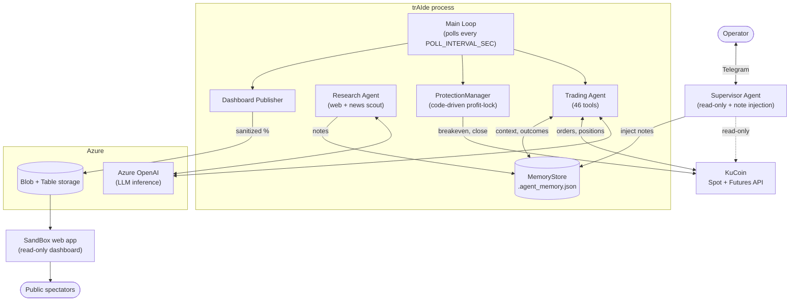
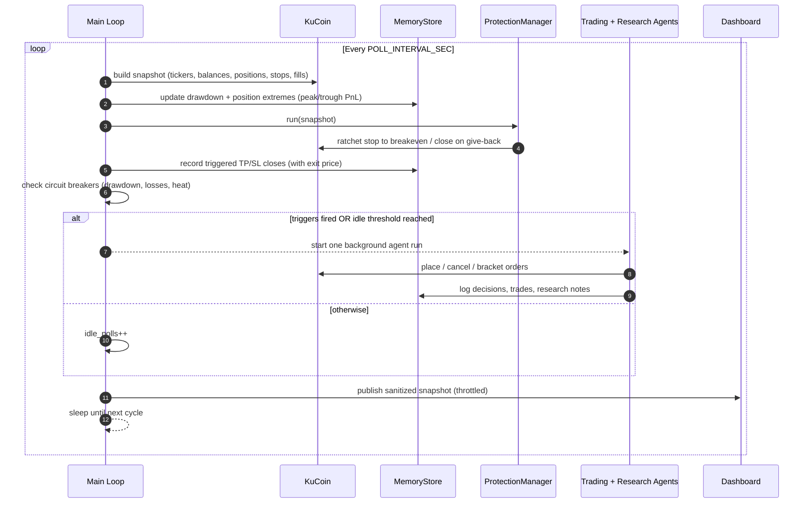
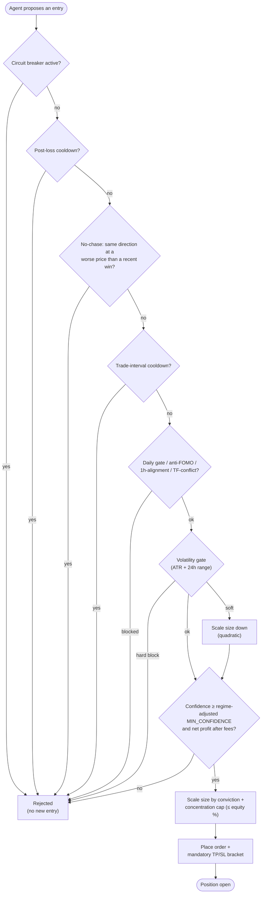
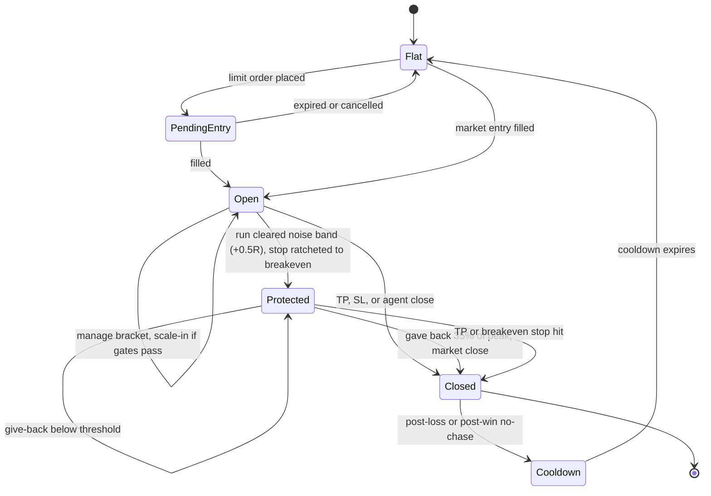
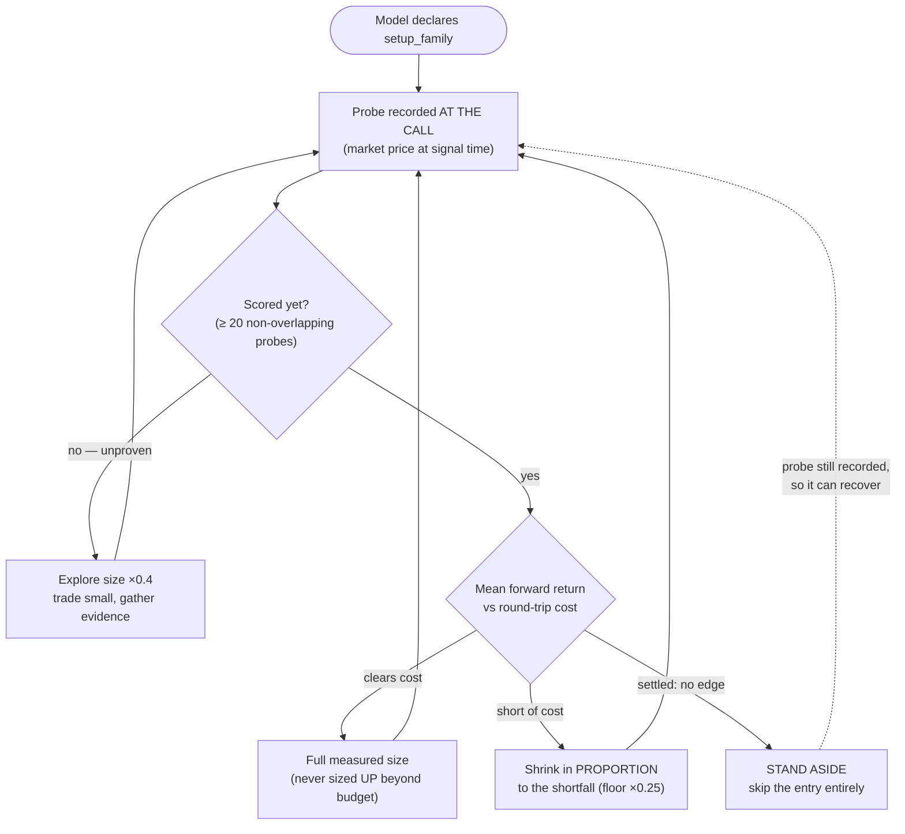
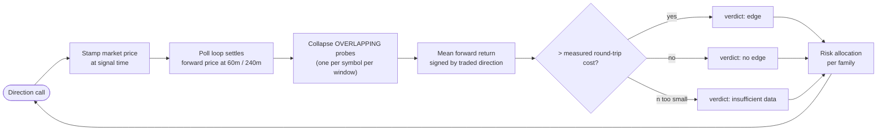
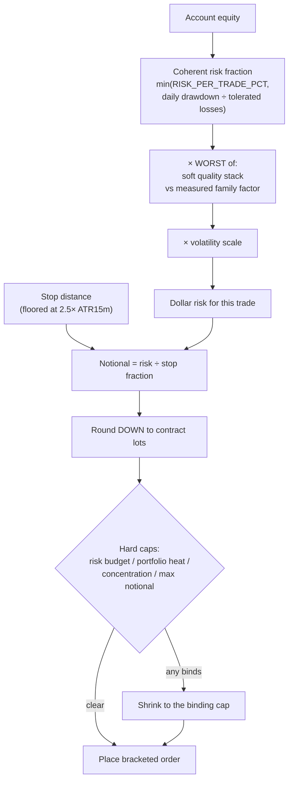
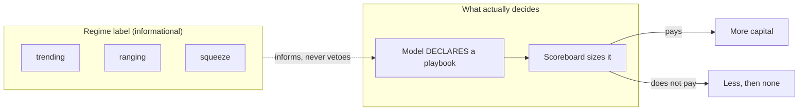
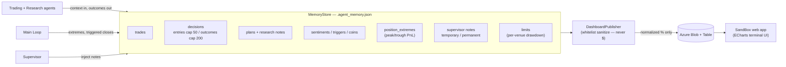

# trAIde

Autonomous multi-agent AI crypto trader powered by Azure OpenAI and KuCoin APIs.

Three specialized agents collaborate in a continuous loop: a **Trading Agent** that executes orders with full risk management, a **Research Agent** that scouts opportunities and market intelligence in parallel, and a **Supervisor Agent** you can talk to via Telegram to monitor and control the system.

## Contents

- [Architecture](#architecture) — six views: components, runtime loop, risk gates, position lifecycle, playbooks & measurement, data flow
- [Features](#features) — technical analysis, risk management, execution, memory, coin universe
- [Setup](#setup)
- [Configuration](#configuration) — all environment variables
- [Telegram Notifications](#telegram-notifications)
- [Supervisor Agent](#supervisor-agent-interactive-telegram-bot)
- [Backtesting](#backtesting)
- [How the Main Loop Works](#how-the-main-loop-works)
- [Project Structure](#project-structure)
- [Running Tests](#running-tests)
- [Deployment](#deployment)

## Architecture

trAIde runs as a single Python process: a continuous **poll loop** drives a **Trading Agent** and a **Research Agent** (both backed by Azure OpenAI), a code-driven **ProtectionManager**, and a sanitized public **dashboard** — while an interactive **Supervisor Agent** lets you steer the system from Telegram. The diagrams below show the same system from six angles.

### System components


```mermaid
flowchart TB
    operator(["Operator"]) <-->|Telegram| sup["Supervisor Agent<br/>(read-only + note injection)"]

    subgraph core["trAIde process"]
        direction TB
        mainloop["Main Loop<br/>(polls every POLL_INTERVAL_SEC)"]
        trade["Trading Agent<br/>(46 tools)"]
        research["Research Agent<br/>(web + news scout)"]
        prot["ProtectionManager<br/>(code-driven profit-lock)"]
        mem[("MemoryStore<br/>.agent_memory.json")]
        dash["Dashboard Publisher"]
    end

    subgraph azure["Azure"]
        aoai["Azure OpenAI<br/>(LLM inference)"]
        blob[("Blob + Table storage")]
    end

    kucoin["KuCoin<br/>Spot + Futures API"]
    sandbox["SandBox web app<br/>(read-only dashboard)"]
    spectators(["Public spectators"])

    mainloop --> trade
    mainloop --> prot
    mainloop --> dash
    trade <--> aoai
    research <--> aoai
    research -->|notes| mem
    trade <-->|orders, positions| kucoin
    prot -->|breakeven, close| kucoin
    trade <-->|context, outcomes| mem
    sup -->|inject notes| mem
    sup -. read-only .-> kucoin
    dash -->|sanitized %| blob
    blob --> sandbox
    sandbox --> spectators
```

**Trading Agent** -- Places bracketed futures limits, manages positions, sets TP/SL, runs multi-timeframe analysis, and explains code-enforced risk decisions. New spot exposure and market entries are disabled; spot tools remain for existing-position protection and closes.

**Research Agent** -- Runs as an explicit, flat-book handoff when research is stale or repeated no-trade runs justify a wider market scan. It owns broad web discovery and logs reusable findings; ordinary position-management runs do not repeat expensive web searches.

**Supervisor Agent** -- Interactive Telegram bot with read access to the entire system. Can query positions, balances, performance, logs, source code, and config. Can inject temporary (one-shot, highest priority) or permanent notes into the Trading Agent's system prompt to influence its behavior.

### Runtime: the poll loop

Every `POLL_INTERVAL_SEC` the loop rebuilds a full account snapshot, runs profit protection, checks circuit breakers, and considers agent invocation when a trigger fires or the idle threshold is reached. The model runs in a single background worker, so slow inference never pauses polling or deterministic protection. Model calls are additionally throttled by book state (`FLAT_AGENT_COOLDOWN_SEC` / `ACTIVE_AGENT_COOLDOWN_SEC`). While flat, price-move magnitude and market breadth automatically shorten the quiet cooldown toward the active cadence.


```mermaid
sequenceDiagram
    autonumber
    participant L as Main Loop
    participant K as KuCoin
    participant M as MemoryStore
    participant P as ProtectionManager
    participant A as Trading + Research Agents
    participant D as Dashboard

    loop Every POLL_INTERVAL_SEC
        L->>K: build snapshot (tickers, balances, positions, stops, fills)
        L->>M: update drawdown + position extremes (peak/trough PnL)
        L->>P: run(snapshot)
        P->>K: ratchet stop to breakeven / close on give-back
        L->>M: record triggered TP/SL closes (with exit price)
        L->>L: check circuit breakers (drawdown, losses, heat)
        alt triggers fired OR idle threshold reached
            L-->>A: start one background agent run
            A->>K: place / cancel / bracket orders
            A->>M: log decisions, trades, research notes
        else otherwise
            L->>L: idle_polls++
        end
        L->>D: publish sanitized snapshot (throttled)
        L-->>L: sleep until next cycle
    end
```

### Entry decision & risk gates

Every proposed entry runs a fixed gauntlet of code-enforced gates before any order reaches the exchange. Position management (manage / hold / protect / close) bypasses the entry gates. In a hostile (bearish / RSI-exhausted) regime the confidence bar is raised and size shrunk; size also scales down with conviction (how far confidence clears the floor). A confirmed trend-aligned short can pass the anti-FOMO gate, and a daily-aligned entry can break the daily-vs-1h deadlock when a counter-bounce is stalling.


```mermaid
flowchart TD
    propose(["Agent proposes an entry"]) --> cb{"Circuit breaker active?"}
    cb -->|yes| reject["Rejected<br/>(no new entry)"]
    cb -->|no| pl{"Post-loss cooldown?"}
    pl -->|yes| reject
    pl -->|no| nc{"No-chase: same direction at a<br/>worse price than a recent win?"}
    nc -->|yes| reject
    nc -->|no| ti{"Trade-interval cooldown?"}
    ti -->|yes| reject
    ti -->|no| dg{"Daily gate / anti-FOMO /<br/>1h-alignment / TF-conflict?"}
    dg -->|blocked| reject
    dg -->|ok| vol{"Volatility gate<br/>(ATR + 24h range)"}
    vol -->|hard block| reject
    vol -->|soft| scale["Scale size down<br/>(quadratic)"]
    vol -->|ok| conf{"Confidence &ge; regime-adjusted MIN_CONFIDENCE<br/>and net profit after fees?"}
    scale --> conf
    conf -->|no| reject
    conf -->|yes| convsize["Scale size by conviction +<br/>concentration cap (&le; equity %)"]
    convsize --> exec["Place order +<br/>mandatory TP/SL bracket"]
    exec --> openpos(["Position open"])
```

### Position lifecycle & profit protection

Once open, a position is protected in code on every poll: the stop ratchets to breakeven once the run clears the noise band (+0.5R at the current stop width), and a give-back of the peak run closes it to lock gains — independent of the LLM.


```mermaid
stateDiagram-v2
    [*] --> Flat
    Flat --> PendingEntry: limit order placed
    PendingEntry --> Flat: expired or cancelled
    PendingEntry --> Open: filled
    Flat --> Open: market entry filled
    Open --> Open: manage bracket, scale-in if gates pass
    Open --> Protected: run cleared noise band (+0.5R), stop ratcheted to breakeven
    Protected --> Protected: give-back below threshold
    Open --> Closed: TP, SL, or agent close
    Protected --> Closed: gave back 35% of peak, market close
    Protected --> Closed: TP or breakeven stop hit
    Closed --> Cooldown: post-loss or post-win no-chase
    Cooldown --> Flat: cooldown expires
    Closed --> [*]
```

### Playbooks, measurement & risk allocation

The bot does not run one strategy. Every entry declares which **playbook** (`setup_family`) it belongs to, and each playbook keeps its own scoreboard. Nothing in the code decides that trend-following or fading is correct — that is the market's call and it changes. The code measures, and capital follows whatever currently pays.

| Playbook | Thesis | Needs the direction call to be right? |
|---|---|---|
| `continuation` | Trade with an established trend; timeframes agree and you expect persistence | Yes |
| `fade_extreme` | Fade a stretched move back toward value (RSI at a 30/70 extreme) | Yes |
| `breakout` | Enter on a break of a range or level, expecting expansion | Yes |
| `range_edge` | Buy support / sell resistance inside a defined range | Yes |
| `funding_carry` | Take the side the 8h funding transfer **pays** | **No** — the transfer happens whichever way price moves |

`funding_carry` is the odd one out on purpose. Every other playbook is a *prediction*; funding is a *mechanical* transfer, and it is the best-documented edge in the perpetuals literature.

#### How a playbook earns (or loses) its capital

A family is never vetoed for being unfashionable — it is sized by its own measured forward return against the round-trip cost it has to clear.


```mermaid
flowchart TD
    declare(["Model declares setup_family"]) --> probe["Probe recorded AT THE CALL<br/>(market price at signal time)"]
    probe --> gate{"Scored yet?<br/>(&ge; 20 non-overlapping probes)"}
    gate -->|"no — unproven"| explore["Explore size &times;0.4<br/>trade small, gather evidence"]
    gate -->|yes| verdict{"Mean forward return<br/>vs round-trip cost"}
    verdict -->|"clears cost"| full["Full measured size<br/>(never sized UP beyond budget)"]
    verdict -->|"short of cost"| shrink["Shrink in PROPORTION<br/>to the shortfall (floor &times;0.25)"]
    verdict -->|"settled: no edge"| aside["STAND ASIDE<br/>skip the entry entirely"]
    explore --> probe
    shrink --> probe
    aside -.->|"probe still recorded,<br/>so it can recover"| probe
    full --> probe
```

The dotted line is the important one. A skipped trade **still records its probe**, because the probe is written when the call is made rather than when an order is placed. Without that, a stood-aside family would starve of the very evidence that could reinstate it — a deadlock this bot hit twice for real.

#### The measurement loop

Win rate and PnL conflate three different things: whether the direction was right, whether the fill was any good, and whether the exit was managed well. `signalEdge` isolates the first.


```mermaid
flowchart LR
    dcall(["Direction call"]) --> stamp["Stamp market price<br/>at signal time"]
    stamp --> wait["Poll loop settles<br/>forward price at 60m / 240m"]
    wait --> dedupe["Collapse OVERLAPPING probes<br/>(one per symbol per window)"]
    dedupe --> score["Mean forward return<br/>signed by traded direction"]
    score --> hurdle{"&gt; measured round-trip cost?"}
    hurdle -->|yes| edge["verdict: edge"]
    hurdle -->|no| noedge["verdict: no edge"]
    hurdle -->|"n too small"| insuf["verdict: insufficient data"]
    edge --> alloc["Risk allocation<br/>per family"]
    noedge --> alloc
    insuf --> alloc
    alloc --> dcall
```

Two details that are easy to get wrong and were both live bugs:

- **Measure from the market price at signal time, not the limit price.** Measuring from the resting limit scores the discount as if it were prediction — on real data that showed a spurious *+1.24% at a 92% hit rate* where the honest figure was *−0.007%*.
- **Collapse overlapping probes.** Thirty probes on one symbol inside four hours are ~one observation. Counting them independently once flipped the live verdict to `edge` at t=+3.66 when the decimated truth was t=+0.51 — below cost, i.e. nothing.

#### From risk budget to contracts

Size is *derived* from risk, never guessed and then capped. Because size is stop-defined, a wider stop buys proportionally fewer contracts at the **same dollar risk**.


```mermaid
flowchart TD
    eq["Account equity"] --> frac["Coherent risk fraction<br/>min(RISK_PER_TRADE_PCT,<br/>daily drawdown &divide; tolerated losses)"]
    frac --> soft["&times; WORST of:<br/>soft quality stack<br/>vs measured family factor"]
    soft --> vol["&times; volatility scale"]
    vol --> budget["Dollar risk for this trade"]
    stop["Stop distance<br/>(floored at 2.5&times; ATR15m)"] --> notional
    budget --> notional["Notional = risk &divide; stop fraction"]
    notional --> lots["Round DOWN to contract lots"]
    lots --> caps{"Hard caps:<br/>risk budget / portfolio heat /<br/>concentration / max notional"}
    caps -->|"any binds"| shrunk["Shrink to the binding cap"]
    caps -->|clear| place["Place bracketed order"]
    shrunk --> place
```

The soft stack and the family factor combine by taking the **worse** of the two, never their product. Multiplying them once collapsed a $66 account to an $8.37 notional against a $10.24 contract minimum — 79 agent runs, zero orders placed.

#### Regimes: why the label is not the decider

The regime classifier is *information*, not a gate. It has to be, because it is unreliable: on live data `market_regime` read `trending` on **68 of 69** entries, including through a two-week range. Keying playbooks off that label made three of the five families structurally unreachable — a counter-trend breakout was rejected before it could log a single probe.


```mermaid
flowchart LR
    subgraph label["Regime label (informational)"]
        trend["trending"]
        range["ranging"]
        squeeze["squeeze"]
    end
    subgraph reality["What actually decides"]
        decl["Model DECLARES a playbook"]
        score["Scoreboard sizes it"]
    end
    label -.->|"informs, never vetoes"| decl
    decl --> score
    score -->|"pays"| more["More capital"]
    score -->|"does not pay"| less["Less, then none"]
```

The declaration is the trigger; the scoreboard is the judge. This is the codebase's core rule in one line: **code enforces survival, the model owns opportunity** — so widening what may be *proposed* is safe, because what may be *risked* stays fully code-governed downstream.

### Memory & dashboard data flow

The local `MemoryStore` is the agent's working memory (auto-pruned by `RETENTION_DAYS`). A whitelist sanitizer publishes a **normalized, dollar-free** projection to Azure, which a separate SandBox web app renders for public spectators.

The published payload includes a **`strategyEdge`** block — the honest headline for the whole system. Win rate and PnL conflate three different things (was the direction call right, was the fill any good, was the exit managed well), so they cannot say *why* the bot is winning or losing. `strategyEdge` measures the signal alone: forward return from the market price at signal time, signed by the traded direction, against the round-trip cost it must clear. It carries `verdict` (`edge` / `no edge` / `insufficient data`), `byHorizon`, and `byFamily` — the per-playbook score — plus `familyRiskFactor`, the multiplier each family is currently earning, so the dashboard explains *why* capital sits where it does rather than only reporting the result. Everything in the block is percentages, counts and verdicts: no balance, equity, position size or account identifier is involved, so it publishes in every disclosure mode including the default `normalized`.

```jsonc
"strategyEdge": {
  "verdict": "no edge", "n": 55, "costPct": 0.12, "bestHorizon": "60m",
  "byFamily": {
    "continuation":  {"n": 28, "mean_pct": -0.04, "hit_rate": 0.36, "verdict": "no edge"},
    "fade_extreme":  {"n": 21, "mean_pct": +0.19, "hit_rate": 0.57, "verdict": "insufficient data"}
  },
  "familyRiskFactor": {"continuation": 0.5, "fade_extreme": 1.0}
}
```


```mermaid
flowchart LR
    subgraph mem["MemoryStore — .agent_memory.json"]
        direction TB
        m1["trades"]
        m2["decisions<br/>entries cap 50 / outcomes cap 200"]
        m3["plans + research notes"]
        m4["sentiments / triggers / coins"]
        m5["position_extremes<br/>(peak/trough PnL)"]
        m6["supervisor notes<br/>temporary / permanent"]
        m7["limits<br/>(per-venue drawdown)"]
    end

    agents["Trading + Research agents"] -->|context in, outcomes out| mem
    mainloop["Main Loop"] -->|extremes, triggered closes| mem
    sup["Supervisor"] -->|inject notes| mem

    mem --> pub["DashboardPublisher<br/>(whitelist sanitize — never $)"]
    pub -->|normalized % only| az[("Azure Blob + Table")]
    az --> sandbox["SandBox web app<br/>(ECharts terminal UI)"]
```

## Features

### Technical Analysis
- **12+ indicators**: EMA (fast/slow), MACD (line/signal/histogram), RSI, ATR, Bollinger Bands (with BBW%), Stochastic %K/%D, VWAP, ADX, Plus/Minus DI
- **4 timeframes**: 1D (regime gate), 4H (40% weight), 1H (35%), 15m (25%) with weighted directional scoring, daily trend gate, and timeframe conflict detection
- **Market regime detection**: Trending (ADX > 25), Ranging (ADX < 20), Squeeze (BBW < 2% + low ADX) -- each with confidence scores
- **Volume profile**: Point of Control (POC), Value Area High/Low (VAH/VAL) for support/resistance levels
- **OI-price divergence**: Classifies open interest vs price movement (strong trend, short covering, aggressive shorts, long capitulation)
- **Funding rate divergence**: Detects hidden strength/weakness from funding rate misalignment

### Risk Management
- **Circuit breakers**: Auto-restrict to close-only mode when daily drawdown, consecutive losses, or portfolio heat exceed thresholds
- **Optional staged take-profit**: Can split TP into 60%/40% tranches, but defaults off because early realization compresses the admitted reward:risk
- **Kelly criterion sizing**: Quarter-Kelly position sizing from rolling trade performance (requires minimum trade history)
- **Post-loss cooldown**: Blocks new entries on a symbol for a configurable period after a loss
- **Profit-lock (breakeven ratchet + give-back cap)**: Enforced in code every poll, independent of the LLM (`src/protection.py`). Once a position's favorable excursion reaches `PROFIT_LOCK_BREAKEVEN_TRIGGER_R`× its initial risk, the stop is ratcheted to a fee-adjusted breakeven so the trade can no longer turn into a loss. If price then gives back ≥ `PROFIT_LOCK_GIVEBACK_PCT` of its peak run, the position is market-closed (reduce-only) to lock the remaining gain. Stops a profitable trade from round-tripping into a loss when the agent fails to tighten protection itself. Set `PROFIT_LOCK_DRY_RUN=true` to log intended actions without placing orders.
- **Trailing ratchet** (`PROFIT_LOCK_TRAIL_ENABLED`, default ON): the primary "let winners run" mechanism, which **replaces** the give-back market-close. Once the peak favourable run reaches `PROFIT_LOCK_TRAIL_ARM_R`, the stop ratchets up to lock the **greater of** `PROFIT_LOCK_TRAIL_LOCK_FRAC × peak` and `peak − PROFIT_LOCK_TRAIL_DISTANCE_R × own-risk`, floored at fee-breakeven and never moving backwards. Because it is a resting stop (not a market close), the trade rides shallow pullbacks to its TP or trails a runner. Self-normalizing in R units — no ATR feed, no percentage or per-symbol knob to tune. (R is anchored to the lifecycle's *original* risk, so it keeps working after the stop reaches breakeven.) **Jul 27 2026 correction:** an earlier tuning armed the trail at 0.5R and locked 50% of the peak. That was measured and it made things *worse* — arming at 0.5R engaged the ratchet on **noise-scale** excursions (the sample's median favourable excursion is 0.27R) and then booked half of it, collapsing the average win. Live over those 27 trades: 37% win rate, avg win +0.38R vs avg loss −0.60R, net −6.4R. Replaying the same entries on real 1-minute paths under the *planned* bracket isolates the exit rule from the agent's re-bracketing — 63% winners but avg win +0.35R against avg loss −1.05R, a **0.33 payoff ratio**, net −4.5R. No win rate survives that payoff. Trail-arm sweep on the same paths — arm 0.40R −0.17R · 0.50R +0.39R · 0.75R −0.24R · **1.00R +2.72R** · 1.25R +2.25R · 1.50R +1.97R. The principle the numbers point at: *a trailing stop must not arm until the trade has cleared the noise band the stop was drawn around* — that band was ~1.4× ATR when the sweep ran. **Aug 11 2026 correction:** that sweep endorsed "1R", but 1R is a distance measured in *stop units*, and the stop floor (`STOP_ATR_FLOOR_MULT`, plus the adaptive widener) has since roughly **doubled** — the live median stop is now **3.0× the intraday ATR vs 1.4× in July**. So the same 1.0R now sits at ~3× ATR, a move the tape almost never makes: over the last 58 live closes the **median favourable excursion was 0.30R and only 12% reached +1R**, so the trail never armed and winners round-tripped from solid green to a full stop-out (**21 trades peaked +0.95R on average and kept +0.24R**; GRAM +0.73R→−0.96R, ADA +0.62R→−1.01R, XRP +0.67R→−0.93R). The parameter stayed frozen in R-units while R's meaning doubled underneath it — the same *stale-constant-after-a-geometry-change* failure the config warns about elsewhere. Arming at **0.5R** restores the ~1.4× ATR distance the July replay actually validated (replaying the 58 closes lifts expectancy from −0.24R toward −0.13R, flat across 0.4–0.6R, so it is not a knife-edge), so it *preserves* that finding under the new geometry rather than overturning it. Defaults are now arm **0.5R**, lock **0.33**, trail **1.0R**. The truly maintenance-free form would anchor the arm to ATR rather than R (`arm_r ≈ 1.4 / stop_atr_mult`) so it cannot re-stale the next time the adaptive stop floor moves — a noted follow-up. The give-back close remains available for `PROFIT_LOCK_TRAIL_ENABLED=false`.
- **Trend-adaptive give-back** (`PROFIT_LOCK_TREND_ADAPTIVE`, legacy path when trailing is off): the tight give-back defaults are a mean-reversion harness — they shook the bot out of exactly the high-ATR *trends* it correctly identified. A trade whose peak run reaches `PROFIT_LOCK_TREND_RUNNER_R`× its **own** risk is a *revealed* trend winner, so the give-back cap arms later (`PROFIT_LOCK_TREND_GIVEBACK_ARM_R`) and tolerates a deeper pullback (`PROFIT_LOCK_TREND_GIVEBACK_PCT`, default 0.55).
- **No-chase after a win**: Blocks re-entering the *same direction* at a *worse* price than a recent winning exit (within `POST_WIN_COOLDOWN_MINUTES`). Stops the "take profit, then immediately re-buy the top" pattern; a genuine pullback (better price than the exit) is still allowed.
- **Regime throttle**: In a hostile regime (bearish or RSI-exhausted daily) the confidence bar is raised (`REGIME_CAUTION_MIN_CONFIDENCE`) and position size shrunk (`REGIME_CAUTION_SIZE_FACTOR`), so the bot trades less and more selectively instead of churning low-conviction bounce-scalps in a downtrend.
- **Conviction-scaled sizing**: Position size scales with how far the entry's confidence clears the (regime-adjusted) floor — a trade that barely clears it gets `CONVICTION_MIN_SIZE_FACTOR` of full size, ramping linearly to full size at `CONVICTION_FULL_CONFIDENCE`. Targets the failure mode where the agent takes a *full-size* position on a setup it itself reads as "mixed / low-conviction" (the pattern behind the SOL drawdown); only ever shrinks, never enlarges.
- **Sizing coherence (soft factors combine by their worst signal, not by a product)**: The soft size multipliers — regime, conviction, relative-strength, loss-streak, and expectancy — used to *compound multiplicatively*, so five independent 0.5–0.6 "be a bit cautious" reads collapsed a 1–2% risk budget to ~0.03–0.05% and every position became fee-dust that couldn't clear round-trip costs even on a win (the account's small-wins / big-losses shape). They are now combined by taking the single **worst** signal (a min), floored at `SIZE_QUALITY_FLOOR` (default 0.5), so a genuine edge is still sized to matter. The hard dollar-risk caps (volatility, `RISK_PER_TRADE_PCT` budget, concentration, portfolio heat) are applied separately and still shrink from there.
- **Noise floor on stop distance** (`STOP_ATR_FLOOR_MULT`, default `2.5`): **the single biggest measured loss driver.** Across the 27 closed futures lifecycles of 20–27 Jul 2026 the median stop sat at **1.4× the 15m ATR** — about **0.7× the 1h ATR, i.e. less than one hourly bar of ordinary movement**. Median favourable excursion was **+0.27R** against targets planned at 2.3–2.7R gross, and **not one trade in the sample reached its take-profit**; trades with tighter-than-median stops averaged **−0.40R** vs **−0.08R** for wider ones. A stop inside the noise band is not an invalidation level, it is a coin-flip on microstructure — the trade dies before the thesis can resolve, however good the read was. The code now floors the stop at `STOP_ATR_FLOOR_MULT × ATR(15m)` (the ATR the daily-gate analysis already computed, so no extra market call). Replaying those same entries on real 1-minute paths turns **−4.5R into +4.9R**, and *every* floor from 1.5× to 5× ATR is positive — the geometry is what matters, not the constant, so 2.5 is chosen as ≈ one full 1h bar of noise (median ATR(1h)/ATR(15m) = 2.18) rather than as the replay's argmax. This is a **survival guard, not an opportunity gate**: it never vetoes a setup and never changes which symbol or direction is traded, it only widens the risk leg — and because position size is stop-defined, a wider stop buys proportionally fewer contracts, so **dollar risk per trade is unchanged**. It also self-tunes (`STOP_ATR_FLOOR_ADAPTIVE`): if the bot's own *winners* routinely survive ≥0.6R of adverse heat, the stop is inside the working range and the floor widens by 0.5 (capped at 4.0). Adaptation is deliberately **widen-only** — winners showing *little* heat is ambiguous (it can mean the stop already eliminated everything that breathed, which is exactly what this account's data looked like: winners averaged 0.17R of heat *because* the tight stop truncated the rest), and the consequences are asymmetric, since a stop inside the noise destroys the strategy while a generous one only costs some size.
- **The floor stays reward:risk-neutral** (`STOP_FLOOR_SCALES_TARGET`, default ON): widening the risk leg while leaving the target where the model put it *mechanically* destroys RR, and the admission gate then rejects the trade. This showed up in the first 12.5 live hours after the fix deployed (2026-08-02): the median gross RR of rejected setups fell **1.79 → 1.23**, exactly cancelling the cost-model fix — which had correctly cut friction drag 0.62 → 0.28 — so `NET RR BLOCK`s stayed flat at 0.19/run while the **order rate dropped 72%**. The floor was converting itself into rejections instead of into smaller size. The resolution is that the floor is a statement about the *scale of movement*, not about the thesis: if the model's stop sat inside the noise band, its target was drawn on the same too-tight scale, so the reward leg travels with the risk leg and the intended R-multiple is preserved exactly. Size still shrinks, so dollar risk per trade is unchanged. This is not moving the target to pass the gate — only the unit of R changes — and it costs nothing in exit quality (replay: +4.12R with the target scaled vs +4.09R unscaled; outcomes are flat across 0.8–2.0R of target distance). ~43% of the observed rejections clear again with it on.
- **Funding carry — the one MECHANICAL playbook** (`regime.funding_carry_setup`, family `funding_carry`): every other family here is a *prediction* and needs the direction call to be right. Across 178 measured probes none of them cleared costs — continuation −0.15%, fade_extreme −0.67%, both settled to `no edge`. Perpetual funding is different in kind: the exchange transfers value between longs and shorts every 8h **regardless of which way price moves**. Positive funding means longs pay shorts (the short is paid); negative reverses it. It is also the best-documented edge in the crypto literature — delta-neutral funding carry is reported around Sharpe 2–6, against an "intraday momentum, reversal, or both" picture for the short-horizon technical signals this bot has been fishing in. The directional version taken here is not the pure hedged arbitrage (price risk remains), but it stacks two effects pointing the same way: you are *paid* to hold, and an extreme rate marks crowded positioning on the other side. The trigger is **derived from measured cost, never hardcoded** — it fires when one funding payment covers at least half the round-trip, so as execution costs fall the bar falls with them. The data was already being fetched (`fetch_funding_rate`, `fundingFeeRate`, funding divergence); nothing consumed it. It is scored in `signalEdge.by_family` like every other playbook, explore-sized while unproven, and stood aside if it fails to pay.
- **The equity index cannot run away** (`_MAX_DAILY_INDEX_STEP`, `_INDEX_SANITY_FACTOR`): the published index is a daily chain — `indexClose_today = prevDayClose x (1 + intradayReturn)` — over an Azure series that is durable and never rewritten, so **one bad point is permanent** and every later day multiplies it forward. On 2026-08-31, after a two-week outage, the dashboard read **+72,546,760%** (index 72,546,860 against a base of 100: a 725,468x blow-up). The way corruption enters is `update_limits` anchoring each new day's baseline to whatever equity reading arrives first — and this account's log is full of KuCoin 504s and "futures event history is incomplete", so a partial snapshot (spot only, futures timed out) anchors the day near zero and the next honest reading computes a five-figure "return". Three guards now: the **baseline** refuses an opening equity more than 10x from yesterday's (a bad read, not an overnight move); the **step** holds the index flat when a day's return exceeds ±50%; and the **chain** re-anchors to the index base when the previous close sits outside base/1000..base*1000. The series read also hides already-corrupt points, because healing today is not enough while the chart still renders the old spike.
- **Overlapping probes count once per window**: probes are recorded minutes apart, so their forward windows overlap almost entirely — thirty probes on one symbol inside four hours are close to *one* observation, not thirty. Counting them independently inflates the sample and the verdict with it. On 2026-08-11 that produced a **false positive on live data**: the 240m horizon read +0.224% (t=+3.66, n=131) and the verdict flipped to `edge`, but decimating to one probe per symbol per horizon window gave **+0.068% (t=+0.51, n=31)** — below the cost hurdle, i.e. nothing. Since this verdict governs how much capital each family receives, an inflated sample can size the bot *up* on noise, which is the most expensive mistake this module could make. `signal_edge_stats` now keeps one observation per symbol per horizon window; different symbols moving at the same time still count separately, because they genuinely are separate observations.
- **Probes record the CALL, not the order** (`memory.record_signal_probe`): signal quality is a property of the direction call, so measuring only *placed* orders biases the sample twice — it drops every setup too small to clear the exchange's contract minimum (a systematic subset, not a random one), and it couples the evidence supply to the very risk factor the evidence is supposed to govern. That coupling deadlocked live on 2026-08-10: continuation measured `no edge` → risk cut to the floor → the resulting **$7.49 notional fell under the $10.24 contract minimum** → order rejected → no probe recorded → with no new probes the family could never earn back the evidence that would restore its size. Probes are now written when the call is made, before any sizing or RR rejection can discard it, into a dedicated bucket retained by count. Risk can fall as low as the measurement warrants without ever starving the measurement.
- **Making the alternative playbook findable** (`entryMap.fadeSetup`): unblocking the fade gates was necessary but not sufficient — over the first 39 measured signals **38 were `continuation` and one was a fade**. The model was not withholding fades; nothing at the point of decision told it one was on the table. Every piece of guidance the analysis emits (`entry_hint`, the `entryMap` note, the ATR-extension framing) is written for arriving at a good price on a *trend* trade, and the regime label reads `trending` on ~93% of symbols so the mean-reversion hints keyed on `ranging` essentially never fire. `analyze_market_context` now reports a `fadeSetup` block whenever 15m RSI sits at an extreme, naming the direction and stating that `setup_family='fade_extreme'` must be passed or the alignment gates will reject it. It asserts nothing about whether fading works — `signalEdge.by_family` keeps that score and risk follows the measurement. It exists so the hypothesis can be *tested at all*, which at one probe in 39 it could not be. A test pins the hint's thresholds to the gate that admits it, so the analysis can never advertise a setup the gate would then refuse.
- **The family allocator is evidence, not caution — so it sits outside the soft floor**: `size_quality_floor` exists to stop several independent "be a bit cautious" *opinions* (regime, conviction, loss-streak) from compounding a real edge into fee-dust. The family factor is not an opinion — it is the measured forward return of that playbook against the cost it must clear — so applying it inside that stack clamped it: measured live on 2026-08-10 the continuation family sat at **−0.29% net against a 0.166% hurdle**, yet no matter how bad the evidence got the combined soft factor could not fall below 0.50. The one signal grounded in data was capped by a guard built for the ones that are not. It is now a separate multiplier, and the penalty is **proportional to the shortfall in units of the cost hurdle** (1.75× there), so there is no tuned constant and a marginal miss is treated differently from a deep one. The floor is deliberately non-zero (0.25): size is stop-defined, so driving it to nil pushes notional under the exchange contract minimum, the order is rejected, no probe is recorded, and the family could never earn back the evidence that would let it recover — the same doom loop the memory-retention fix had to undo.
- **Setup families and measured allocation**: every entry declares a `setup_family` — `continuation`, `fade_extreme`, `breakout`, `range_edge` — and `signalEdge.by_family` scores each playbook on its **own** forward return versus costs, with risk flowing toward whichever currently pays (`edge.family_size_factor`, which never enlarges risk). Nothing in the code decides that trend-following or fading is correct; that is the market's call and it changes. A family reading `no edge` over a real sample is shrunk; a family reading `insufficient data` keeps full risk precisely so it can earn the evidence that judges it. This replaced a structural blind spot: the bot could only ever express continuation, because its regime label read `trending` on **68 of 69** recorded entries, the daily gate blocks counter-daily entries, and the 1h gate blocks anything the 1h opposes — which a fade has against it by definition. Meanwhile continuation measured **−0.017% gross over 3,408 samples** on the live universe: flat, and flat does not cover a 0.10% round trip. `allow_fade_extreme` now lets a declared fade past the alignment gates at a textbook RSI 30/70 extreme *against* the entry direction, so the alternative can at least be measured — deliberately without any starting advantage, since the same test showed fading positive in both halves but only at t≈1.0–1.6 over 135 independent events. Suggestive, not established, and not something to hardcode.
- **Zero edge → zero stake (stand aside)** (`edge.family_stand_aside`, Aug 12 2026): `family_size_factor` floored a no-edge playbook at quarter-size rather than nil — a nil stop-defined size fell under the contract minimum and, *when probes were recorded only on placed orders*, starved the family of the evidence that would restore it (the doom loop above). That loop no longer exists: probes are recorded at the direction **call**, so a *skipped* trade still feeds the measurement. With evidence decoupled from execution the floor is free to fall to its mathematically-correct value — a playbook whose mean forward return does not clear its round trip has **non-positive expectancy on the signal itself**, and the growth-optimal (Kelly) stake on a non-positive-edge bet is zero. So the bot now **declines** an entry whose family reads `no edge` over a real sample (`n ≥ 20`) instead of staking floor-size fee-dust on it, and re-opens it automatically the moment its forward return beats cost. This is **bet-sizing (survival), not a directional veto (opportunity)**: it acts only on the bot's own measurement of its own calls, never on which coin or direction is right. Replayed over the last 20 live closes it skips exactly the 9 `continuation` entries (that family measured `no edge`, n=44), **sparing +6.64R**, while leaving `fade_extreme` (`insufficient data`) and every other playbook free to trade. Off-switch: `EDGE_STAND_ASIDE_NO_EDGE_FAMILY=false`.
- **Every playbook can reach the book — measurement, not a trend gate, decides which gets capital** (`regime.allow_declared_setup` + `edge.family_explore_factor`, Aug 12 2026): the alignment gates only admit trend-aligned entries freely, and a trend-aligned entry is tagged `continuation` — so `continuation` was the *only* family that could ever reach the book. It accumulated ~every probe, measured `no edge`, and the model kept taking it for want of anything else it was allowed to express. `allow_fade_extreme` opened one escape hatch keyed on an RSI extreme, but `breakout` and `range_edge` had none and are never auto-inferred, so a counter-trend one was rejected *before it could log a single probe* — `samples: 0` forever, a chicken-and-egg that kept them permanently "untested". This generalises the fade-extreme carve-out: a deliberately-declared `breakout`/`range_edge` is admitted past the daily/1h gates **on the model's declaration alone**. Which playbook to run is an *opportunity* call (the model's job); a hardcoded trend gate deciding it is exactly the veto this codebase avoids. Survival stays fully code-governed, just **downstream** of the gate: the probe records at the call, `family_explore_factor` sizes an unproven playbook down to **explore-size (0.4×)** — cheap because a family's forward-return evidence records from the market price *independent of our stake*, so we learn a new playbook while risking little — `family_size_factor` shrinks it on any measured shortfall, and `family_stand_aside` skips it outright once it settles to `no edge`. A declared breakout that turns out not to pay still logs its evidence, is sized to a quarter, and eventually to zero — by measurement, not by a pre-trade veto. This widens what may be *proposed*, never what may be *risked*. Off-switches: `DECLARED_SETUPS_ENABLED=false`, `DECLARABLE_SETUP_FAMILIES`, `EDGE_EXPLORE_UNPROVEN_FAMILY_FACTOR`.
- **Signal-edge measurement** (`signalEdge` in the edge report): the feedback loop the bot never had. Every other statistic measures an *outcome*, which conflates three different things — whether the direction call was right, whether the fill was any good, and whether the exit was managed well. That conflation is why several rounds of correct exit, cost and sizing fixes did not stop the bleeding. Each entry now stamps `marketPriceAtSignal` (the **live** price when the call was made, not the resting limit price), the poll loop settles 1h/4h forward prices from the ticker snapshot it already has, and `edge.signal_edge_stats` reports mean forward return signed by the traded direction, versus the round-trip cost. Measuring from the *limit* price instead scores the resting discount as prediction — on this account's data that produced a spurious **+1.24%/15m at a 92% hit rate**, where the correct measurement from market price was **−0.007%**. The verdict is deliberately blunt: `edge` / `no edge` / `insufficient data`. A signal whose forward return does not clear costs cannot be made profitable by any exit or sizing scheme — it can only lose more slowly.
- **Learning data ages out by being superseded, not by the clock**: realized closes (`pnl != None`) and filled orders are exempt from the `retention_days` cutoff and retained purely by count (`MAX_CLOSED_TRADES=200`, `MAX_TRADES=100`). They are the training data for every adaptive guard — `edge_stats`, `entry_quality_stats`, expectancy sizing, the symbol bench, measured slippage and the adaptive stop floor all read them. Time-pruning them created a **doom loop**, measured live on 2026-08-06: as the trade rate fell the 7-day window emptied until only 8 closes remained, all recent losses. The controller then reported an 11% win rate and a 6-loss streak, halved position size, and the agent stood aside in **356 of 358 runs** — which produced no new closes, so the window could only get staler and bleaker. A quiet spell must never be self-reinforcing. Declines and unfilled orders stay ephemeral.
- **Self-calibrating friction** (`SLIPPAGE_AUTOTUNE_ENABLED`, default ON): every RR gate, net-profit check and fee-adjusted breakeven prices friction as `fee_rate + ESTIMATED_SLIPPAGE_PCT` **per side**, so a constant set once and never revisited silently becomes the strategy. The live config assumed **0.10%/side** while measured entry slippage was **0.008% mean / 0.025% p90** — a ~12× overstatement. Round-tripped that is 0.32% of notional against a real ~0.08%, and at the account's median risk/notional (1.3%) it charged every setup a **phantom 0.18R**. To still clear a 1.5 net-RR floor the model had to plan ~2.7R *gross* targets — which the tape never reached, and which pulled the stop inward to keep the ratio. Overstating costs does not make a bot conservative; it makes it plan trades that cannot win. The estimate is now measured from the bot's own fills (conservative upper percentile, clamped to `[0.01%, 3× prior]`, `ESTIMATED_SLIPPAGE_PCT` used as the prior until `SLIPPAGE_AUTOTUNE_MIN_SAMPLES` fills exist) and adapts in **both** directions if execution genuinely degrades.
- **Risk-targeted sizing** (`RISK_TARGETED_SIZING`, default ON): position size is computed **from** the risk budget and the stop distance, not merely capped at it. `bracket_risk_scale` only ever shrinks, so the actual bet was whatever notional the model happened to name — and across the 35 recorded lifecycles realized dollar risk ranged over **18.9x** ($0.06 to $1.17 on a ~$68 account), uncorrelated with conviction or outcome. The winners were systematically the small bets and the losers the large ones, so the last 9 trades closed **+0.50R but −$0.12**: a positive edge in R that still lost money. Conviction remains the size lever, but it acts through the regime/confidence/expectancy multipliers rather than an arbitrary number, so the *unit* of risk is constant while conviction still scales it. Pairs with the stop noise floor: a wider stop now buys proportionally fewer contracts instead of a bigger loss.
- **Coherent risk fraction**: the effective risk per trade is `min(RISK_PER_TRADE_PCT, CB_MAX_DAILY_DRAWDOWN_PCT / (CB_MAX_CONSECUTIVE_LOSSES + 1))`. Per-trade risk and the daily drawdown stop are not independent settings — at 2%/trade against a 3% daily stop, **two losers end the day** on an account taking 5–9 trades daily. The inconsistency went unnoticed for months only because realized risk was never actually 2% (it averaged 0.52%), so the drawdown stop never had a chance to bite. Deriving one from the other keeps them coherent with no extra knob: with the shipped defaults that is **0.75%**, which absorbs three full stop-outs inside the daily budget.
- **Marketable entries (fill-rate fix)**: a passive limit resting away from price filled only ~18% of the time — in a trend price never comes back, so the bot systematically missed the winners and filled only when the move failed (adverse selection). Two candidate cures were tested by replaying all 82 expired limits against real 1-minute paths, and they point in **opposite** directions. *Waiting longer is a trap*: extending the entry TTL fills more orders but those extra fills lose (−0.79R mean at 30min, −0.30R at 60min, −0.37R at 240min), because a limit that fills late only fills when price came to it. *Crossing works*: the same 82 plans taken at the live price return **+13.05R over 80 trades** (+0.163R mean, 65% win). What makes a cross safe is not conviction but whether the bracket still has edge from the worse entry — filtering by confidence ≥ 0.80 yields +0.050R mean, filtering by "still clears the RR floor after crossing" yields **+0.388R**. So the old 0.15%-band-plus-confidence rule (which admitted just 3 of 80 plans, against a median required cross of 0.82%) is replaced: `MARKETABLE_ENTRY_MAX_DEV_PCT` is now only an outer sanity bound, and the binding test is the **post-cost RR gate already evaluated at the crossed price**. The atomic TP/SL bracket still attaches, so a marketable fill is never naked.
- **Entry-planning wisdom (not a gate)**: Chasing is an entry-*timing* mistake (opportunity), not a survival threat — the bracket and risk caps already bound the loss — so it is left to the agent's judgement rather than a hardcoded veto (which would fight the agentic design and need tuning). The analysis surfaces an `entryMap`: how far price sits beyond the 15m VWAP in ATR units (`extensionAtrLong/Short`) plus the nearest pullback/retest anchors (VWAP, band-mid, prior breakout shelf, fib of the last impulse). The prompt's **OPTIMAL ENTRY PLANNING** step then makes the agent reason about the highest-EV arrival price — after a vertical spike it rests a limit at the anticipated pullback (avoiding the chase *and* capturing the next leg) instead of buying the local peak. This improves automatically as the model improves; no threshold to maintain.
- **Strong-trend continuation (don't wait forever for a pullback)**: a pullback entry is only higher-EV if the pullback actually arrives. On a confirmed strong-trend leader that keeps running without retracing, "wait for the pullback" silently becomes "miss the whole move" — the bot churned unfilled ONDO limits while ONDO trended away. Unfilled entry-limit expiries are now recorded as agent-visible `entryExpiries` events (previously only logged), so the agent *sees* its own limits dying on a symbol and, per desk practice (scale-in), takes a **reduced-size bracketed marketable continuation** rather than re-placing the same never-filling limit — or stands down and rotates. Gated to an intact trend; a rolling-over trend gets no continuation.
- **Post-trade entry-quality feedback (compounding wisdom)**: On every close, `edge.entry_quality_stats` derives — purely from data already recorded — how well the entry was timed: `avgMaeR` (how far price went *against* the fill before the trade worked, in R), `avgEntryExtensionAtr` (how stretched entries were vs the 15m VWAP), and `betterEntryRate`. This is fed back in `edgeReport.entryQuality` so the agent can see its own pattern ("your last entries kept dipping 0.6R before working — rest limits at the pullback") and self-correct. It's a mirror, not a rule: no restriction is imposed, and the signal sharpens the model's entry timing over time.
- **Lifecycle risk + concentration caps**: Every add-on shares the original position's stop-defined risk and projected same-symbol exposure budgets. Caps are reapplied after contract-lot rounding; an exchange minimum that exceeds either budget is rejected. Add-ons require a live fee-adjusted breakeven stop and may never loosen it or average down.
- **Correlation gate + relative-strength exception**: Blocks ordinary non-major alt longs while BTC's daily regime is bearish. A rotating leader may pass only when its 1D/4H/1H/15M trends are all bullish, strength is high, and confidence clears `RELATIVE_STRENGTH_MIN_CONFIDENCE`; it is then reduced by `RELATIVE_STRENGTH_SIZE_FACTOR`. No symbol is hardcoded.
- **New-listing guard**: Blocks futures entries on contracts younger than `MIN_FUTURES_LISTING_AGE_DAYS` (via the contract's first-open date). Freshly-listed perps are thin and ultra-volatile — RE-USDT had a ~100% intraday range on day one.
- **Minimum reward:risk (futures)**: Rejects any futures entry whose **post-cost** reward:risk is below `MIN_FUTURES_RR`, including estimated entry/exit fees and slippage. Dollar risk is controlled by position size, not by widening the stop or inventing a farther target.
- **Adaptive edge controller** (`src/edge.py`): derives risk posture from rolling realized results and automatically relaxes when evidence recovers. Code-enforced actions surfaced in `edgeReport`: (1) **direction/symbol risk scaling** — a sufficiently sampled losing long/short direction or symbol trades at `EDGE_NEGATIVE_EXPECTANCY_SIZE_FACTOR`; (2) **severity-scaled symbol bench** — a repeatedly losing symbol is quarantined for an automatically scaled cooldown; (3) **loss-streak throttle** — consecutive losses reduce all new-entry size. Targets stay structural: weak results reduce capital at risk instead of moving take-profits farther away.
- **Give-back arming at 1R** (`PROFIT_LOCK_GIVEBACK_ARM_R`): the give-back cap only acts once a run has reached this multiple of the trade's *own* initial risk (stop distance) — sub-1R wobble belongs to the original stop. Stops the cap from strangling winners into fee-scale scratch closes while losses ride to the full stop.
- **Trend-aligned shorts**: In a confirmed downtrend the anti-FOMO gate would otherwise force the bot to only ever long oversold bounces. With `TREND_ALIGNED_SHORTS_ENABLED`, a short into an exhausted-bearish daily is permitted **when 1h and 15m both confirm** the downtrend is resuming and confidence clears a higher bar (`TREND_SHORT_MIN_CONFIDENCE`) — letting the bot trade *with* the trend, not only against bounces.
- **Reversal longs**: The daily gate is a *lagging* signal — it reads bearish through the bottom of a move, so the bot is structurally forbidden from catching a reversal (in the Jul 2–5 2026 chop it sat out an +11% ETH bounce, blocked from every long). With `REVERSAL_LONGS_ENABLED`, a long against a bearish daily is permitted **only when 1h and 15m have both turned bullish** and confidence clears a high bar (`REVERSAL_LONG_MIN_CONFIDENCE`, default 0.80) — a confirmed turn, not knife-catching. Majors only (non-major alt longs stay blocked by the correlation gate), and the reward:risk floor still applies to whatever passes.
- **Reversal shorts** (`REVERSAL_SHORTS_ENABLED`): exact mirror — when the regime flips bullish, the daily gate blocks every short even as intraday clearly rolls over (Jul 7–8 2026 pullback: "daily is bullish, shorts blocked" repeating while SOL fell 5%). A short against a bullish daily is permitted only when **1h and 15m have both turned bearish** and confidence ≥ `REVERSAL_SHORT_MIN_CONFIDENCE` (0.80). Same discipline: confirmed turns only, R:R floor/bench/sizing still apply.
- **Anti-FOMO daily-exhaustion block**: Refuses trend-continuation entries (long at bullish-overbought / short at bearish-oversold) when the 1D RSI is at an extreme (≥70 or ≤30). Counter-trend reversal setups remain allowed, and a confirmed trend-aligned short can be re-permitted (see above).
- **Anti-FOMO stacking**: Refuses adds to an existing position — even a profitable one — when the daily is exhausted in the same direction. Stops doubling down at the top/bottom.
- **Volatility soft-gate**: Above `MAX_ATR_PCT_FOR_ENTRY` (default 9%), position size is scaled down *linearly* (`threshold/ATR`, floor 50%) — a wider stop on a high-ATR name already sizes the position down via the risk budget, so the old quadratic penalty double-counted volatility and made the market's strongest movers untradeable at meaningful size exactly when they trended hardest. Above 1.5× the threshold the entry is hard-blocked as a data-quality / price-scale-discontinuity guard.
- **Squeeze-breakout signal**: Structured `squeeze_breakout` field (`long` / `short` / `None`) surfaced in `analyze_market_context`. Fires only on the fresh transition out of a 1h Bollinger squeeze (BBW expanding ≥25% off the floor, ADX>20, price beyond BB band, RSI confirming). Takes the asymmetric upside after coiled-volatility periods; volume ≥1.5× 20-candle average is required confirmation. Anti-FOMO block still wins if daily is exhausted in the same direction.
- **1h alignment requirement**: Blocks new entries and add-ons when the 1h bias opposes the proposed side, regardless of what the daily trend says. The 1h timeframe captures the multi-hour trajectory — when daily EMAs are still bullish but 1h is bearish, the daily uptrend is in correction (not a healthy pullback) and buying bounces gets stopped out repeatedly. Catches the failure mode where 15m briefly turns bullish on a dead-cat bounce while the actual correction is still in progress.
- **Deadlock break**: The daily gate (blocks the counter-trend direction) and the 1h-alignment gate (blocks the daily-aligned direction during a counter-bounce) can together strand the bot flat in both directions in a clean trend. With `DEADLOCK_BREAK_ENABLED`, the *daily-aligned* entry (short in a bearish daily, long in a bullish daily) is allowed past the 1h gate **only when the counter-bounce is stalling** — 15m no longer confirms it — and confidence clears `DEADLOCK_MIN_CONFIDENCE`. Takes the trend-continuation trade instead of standing aside, without knife-catching a live bounce. Disjoint from trend-aligned shorts (which covers the *exhausted*-daily case).
- **Timeframe-conflict gate**: Secondary check on top of 1h alignment — blocks new entries when `analyze_market_context` reports `timeframe_conflict=True` AND the 15m bias opposes the proposed direction. Catches lower-TF disagreement that slips past 1h alignment (e.g., 15m bearish while 1h is neutral). Position management (manage/hold/protect) is unaffected by both gates.
- **Atomic entry bracket** (`ATOMIC_BRACKET_ENABLED`): futures limit entries attach TP/SL via KuCoin's st-orders endpoint, so protection arms with the fill. If the atomic endpoint fails, the entry fails closed; there is no plain/unprotected-order fallback.
- **Live entry lease** (`src/safety.py`): every background run receives revocable order authority. Incomplete account/fill truth, a 20-minute run timeout, or shutdown revokes it. Immediately before an entry, equity, positions, stops, and pending orders are fetched again under a serialized exchange-write lock; any structural change forces re-analysis.
- **Hard unrealized-loss cap**: the polling protection loop closes a futures lifecycle when its unrealized loss exceeds `RISK_PER_TRADE_PCT` of current equity. This is a last-resort guard; gaps, fees, and slippage can still make realized loss larger.
- **Real OI sampling**: OI/price quadrants use timestamped exchange open-interest observations with minimum age/change thresholds. The signal stays neutral without a valid baseline; 24h volume is never substituted for OI direction.
- **Unprotected-position safety net** (`EMERGENCY_SL_PCT`, in `src/protection.py`): every poll, any open futures position found with no protective stop (after a short grace so an attached bracket can appear) gets an emergency SL at `EMERGENCY_SL_PCT` from entry + a TP at `MIN_FUTURES_RR`× that — within ~1 poll, not the next agent run. It's a floor, not the agent's considered bracket; the agent refines it next run. Guarantees no position is ever left naked.
- **Realized-vs-intended R:R reality check**: each close records its MFE/MAE (peak/trough PnL), and the agent's `edgeReport` surfaces `realizedRewardRisk` (avg win ÷ avg loss actually achieved). When it's far below the intended floor, the agent is told the take-profits are set too far to reach and to pull them to the nearest realistic structural target with a tighter stop — so the RR floor passes at a *reachable* scale rather than aiming at targets that never fill.
- **Early invalidation cut** (`EARLY_CUT_*`, in `src/protection.py`): a *time/heat stop* — a position that (after `EARLY_CUT_GRACE_MIN`) has **never** gone meaningfully green *and* has run `EARLY_CUT_MAE_FRAC` of the way to its stop is closed early rather than riding to the full SL, front-running an almost-certain stop. Per MAE research (and the bot's own data — winners here breathe ~0.57R of adverse excursion), the cut threshold **must sit outside the MAE band of winning trades**, or it stops you out when you're right; `EARLY_CUT_MAE_FRAC` was therefore raised 0.6 → **0.85** after a mid-coil trend long (NEAR) was cut at 0.65R moments before a +4% breakout. At 0.85 it only fires when the stop is nearly certain, leaving normal pre-breakout heat alone. Disjoint from the give-back/breakeven guards (which only act once a trade has gone green).
- **Mandatory TP/SL**: Every position must have stop-loss and take-profit (no naked positions)
- **ATR-based stops**: Stop distance computed from Average True Range for volatility-adaptive risk
- **Daily trade limits**: Per-symbol and total daily trade caps
- **Fee-aware profit targets**: Minimum net profit and ROI thresholds after accounting for fees and slippage

### Order Execution
- **Futures-only new exposure**: New positions use non-marketable `place_futures_limit_order` requests with atomic TP/SL. Spot and futures market orders are close/emergency-only; existing spot holdings can still be protected or closed.
- **Target-price limit entries**: Futures entries wait at a technically derived level (EMA, Bollinger Band, swing high/low, VWAP, Fibonacci), preventing shorting into a dump or buying into a pump.
- **Pending order safety**: Every run includes pending orders; code permits only one futures entry per symbol per run/book, tags bot-created GTC entries, and automatically cancels tagged entries older than `ENTRY_LIMIT_EXPIRY_MINUTES`. Manual and protective orders are never auto-cancelled.
- **Fee-aware entry gate**: Atomic limit entries must clear configured net-profit/ROI floors after estimated fees and slippage.
- **Leverage control**: Configurable max leverage (up to 125x) with automatic margin mode management
- **Fund transfers**: Move USDT between spot, futures, and financial/Earn accounts

### Memory & Learning
- **Trade memory**: Records all trades, decisions, plans, sentiments, triggers, and fee snapshots
- **Persistent event inbox**: Fill and close payloads survive restarts and model failures. They are acknowledged only after a successful agent run, eliminating repeated poll-triggered runs without silently dropping unprocessed events.
- **Two-tier decision retention**: realized closed-trade outcomes (those with a PnL) are kept far longer (cap 200) than routine entry/decline decisions (cap 50), so win/loss history — and the exit prices the no-chase guard relies on — is never crowded out by no-trade decisions
- **Performance tracking**: Win rate, PnL, trade counts split by venue (spot/futures) and mode (paper/live)
- **Position extremes**: Tracks peak and trough unrealized PnL during position lifetime for post-trade analysis
- **Drawdown tracking**: Per-venue daily drawdown percentage
- **Adaptive sizing**: Kelly fraction adjusts position size based on actual win rate and profit/loss ratio
- **Automatic retention**: Items older than configurable retention period are pruned

### Coin Universe Management
- **Market screener** (`scan_futures_market`): the Research and Trading agents can screen the **entire** KuCoin USDT-perp universe (~500 contracts) ranked by momentum / gainers / losers / volume, instead of only looking at coins already on the list. Every result pre-clears the liquidity floor (`SCREENER_MIN_TURNOVER_USD_24H`) and the minimum listing age, so discovery stays liquid and mature (no fresh micro-caps). This closes the gap where the scout could only evaluate symbols it already knew by name and never discovered the coin that was actually moving. Entry gates (daily/1h/R:R/correlation) still apply at trade time.
- Seed with `COINS` env var; agent can dynamically add/remove coins with reasons and exit plans when `FLEXIBLE_COINS_ENABLED=true`
- Auto-discovers unlisted holdings in spot account (worth >= $0.50) and adds them to the active list
- Removes coins after 3 consecutive ticker fetch failures (flexible mode only)
- **Forced research handoff**: after `RESEARCH_HANDOFF_AFTER_NO_TRADE_RUNS` consecutive no-trade runs (stuck / declining), the Trading Agent is forced to hand off to the Research Agent to overhaul the coin list and surface fresh opportunities — rate-limited by `RESEARCH_HANDOFF_COOLDOWN_MIN` so the costly web-research sweep can't fire every cycle

## Setup

1. Copy `.env.example` to `.env` and fill in credentials
2. Install dependencies and run:

```bash
python -m venv .venv
source .venv/bin/activate  # or .venv\Scripts\activate on Windows
pip install -r requirements.txt
python -m src.main
```

The agent runs in a continuous loop: polls KuCoin, tracks price changes, performs web searches for market context, and invokes the AI agents when triggers fire. Keep `PAPER_TRADING=true` while testing.

## Configuration

### Required

| Variable | Description |
|----------|-------------|
| `AZURE_OPENAI_ENDPOINT` | Azure OpenAI resource endpoint |
| `AZURE_OPENAI_API_KEY` | Azure OpenAI API key |
| `KUCOIN_API_KEY` | KuCoin API key |
| `KUCOIN_API_SECRET` | KuCoin API secret |
| `KUCOIN_API_PASSPHRASE` | KuCoin API passphrase |
| `COINS` | Comma-separated symbols (e.g., `BTC-USDT,ETH-USDT,SOL-USDT`) |

### Trading Controls

| Variable | Default | Description |
|----------|---------|-------------|
| `PAPER_TRADING` | `true` | Simulate orders without real execution |
| `MAX_POSITION_USD` | `500` | Maximum spend per trade |
| `RISK_PER_TRADE_PCT` | `0.02` | Maximum stop-defined risk per trade as a fraction of equity (2%, aggressive); fees, slippage, and gaps can make realized loss higher |
| `SIZE_QUALITY_FLOOR` | `0.5` | Floor for the *combined soft* size factor (regime/conviction/relative-strength/streak/expectancy combined by their worst signal, not multiplied). `1.0` disables all soft shrink |
| `MIN_ENTRY_NOTIONAL_USD` | `0` | Fee-aware floor: bump a sub-floor sized entry up to this notional (still bounded by risk/concentration/heat caps). `0` = off (pure risk-budget sizing) |
| `MIN_CONFIDENCE` | `0.65` | Minimum confidence score (0-1) to place a trade |
| `MAX_LEVERAGE` | `3` | Maximum futures leverage (1-125) |
| `MAX_TRADES_PER_SYMBOL_PER_DAY` | `6` | Daily trade cap per symbol (curbs fee churn and loss streaks) |
| `MIN_NET_PROFIT_USD` | `0.50` | Minimum net profit target after fees |
| `MIN_PROFIT_ROI_PCT` | `0.008` | Minimum ROI target (0.8%) after fees |
| `ESTIMATED_SLIPPAGE_PCT` | `0.001` | Per-side slippage **prior** for RR/profit gates. Superseded by the bot's own measured fills once `SLIPPAGE_AUTOTUNE_MIN_SAMPLES` exist |
| `SLIPPAGE_AUTOTUNE_ENABLED` | `true` | Measure per-side slippage from real fills instead of assuming it (the static 0.1% was ~12x the measured 0.008% and taxed every setup a phantom 0.18R) |
| `SLIPPAGE_AUTOTUNE_MIN_SAMPLES` | `8` | Fills required before the measurement displaces the prior |
| `RANGE_TRADING_ENABLED` | `true` | Enable mean-reversion in ranging/sideways markets |
| `SENTIMENT_FILTER_ENABLED` | `false` | Require positive sentiment before trading |
| `SENTIMENT_MIN_SCORE` | `0.55` | Minimum sentiment score (0-1) when filter enabled |

### Advanced Trading Features

| Variable | Default | Description |
|----------|---------|-------------|
| `PARTIAL_TP_ENABLED` | `false` | Opt in to 60%/40% staged take-profit; off by default because the current staging geometry reduces realized reward:risk |
| `KELLY_SIZING_ENABLED` | `true` | Use Kelly criterion for adaptive position sizing |
| `KELLY_MIN_TRADES` | `30` | Minimum trade history before Kelly sizing activates |
| `PREFER_LIMIT_ORDERS` | `true` | Legacy spot-entry preference; new spot exposure is currently disabled |
| `LIMIT_ORDER_TIMEOUT_SEC` | `20` | Timeout before falling back to market order (fee-saving path) |
| `ENTRY_LIMIT_EXPIRY_MINUTES` | `15` | Cancel unfilled target-price entry limit orders after this many minutes (recycles unfilled passive limits faster) |
| `MIN_ENTRY_DEVIATION_PCT` | `0.0005` | Minimum distance (0.05%) from current price for a *low-conviction* resting limit; high-conviction entries use the marketable band instead |
| `STOP_ATR_FLOOR_MULT` | `2.5` | Minimum stop distance as a multiple of the 15m ATR. The median live stop was 1.4x (< one 1h bar), which no trade could survive; size shrinks to hold dollar risk constant. `0` disables |
| `STOP_ATR_FLOOR_ADAPTIVE` | `true` | Widen the floor by 0.5 (max 4.0) when the bot's own winners survive >=0.6R of adverse heat. Widen-only by design |
| `STOP_FLOOR_SCALES_TARGET` | `true` | Scale the take-profit by the same factor the floor widened the stop, so the floor is RR-neutral and shows up as smaller size rather than as RR rejections |
| `STOP_ATR_FLOOR_MAX_WIDEN` | `4.0` | Never rewrite a stop by more than this factor — past it, it is a different trade |
| `RISK_TARGETED_SIZING` | `true` | Size each entry FROM the risk budget and stop distance instead of capping a model-guessed notional (realized risk varied 18.9x without it) |
| `MARKETABLE_ENTRY_MAX_DEV_PCT` | `0.01` | Outer bound on how far an entry may cross the spread to fill immediately; the post-cost RR gate at the crossed price is the binding test. `0` disables (passive-only) |
| `MARKETABLE_ENTRY_MIN_CONFIDENCE` | `0` | Optional extra conviction bar for crossing. Default off: confidence measured as a weak filter (+0.050R) versus RR-after-cross (+0.388R) |
| `MAX_ATR_PCT_FOR_ENTRY` | `9` | Soft volatility gate: above this daily ATR %, position size is scaled down *linearly* (`threshold/ATR`, floor 50%). Above 1.5× this value (13.5% default), entry is hard-blocked as a data-quality guard. |
| `MAX_24H_VOLATILITY_PCT` | `30` | Exclude/hard-block contracts whose absolute 24h price change exceeds this % (separate from ATR gate) |
| `POST_LOSS_COOLDOWN_MINUTES` | `30` | Block new entries on a symbol after a loss |
| `MIN_TRADE_INTERVAL_MINUTES` | `10` | Minimum interval between trades on the same symbol (anti-overtrading) |

### Circuit Breakers

| Variable | Default | Description |
|----------|---------|-------------|
| `CB_MAX_DAILY_DRAWDOWN_PCT` | `3.0` | Restrict new exposure at a 3R daily drawdown with the default 1% lifecycle risk |
| `CB_MAX_CONSECUTIVE_LOSSES` | `3` | Restrict trading after N consecutive losses |
| `CB_MAX_PORTFOLIO_HEAT_PCT` | `6.0` | Maximum total capital at risk % across open positions (the "6% rule") |
| `CB_COOLDOWN_MINUTES` | `120` | Cooldown duration after consecutive loss trigger |

When a circuit breaker fires, the agent enters close-only mode: it can adjust stops, close positions, and manage risk, but cannot open new positions. A Telegram notification is sent.

### Profit Protection

Code-driven guards enforced outside the LLM (`src/protection.py`). They run every poll regardless of whether the agent runs, so a profitable trade can't quietly round-trip into a loss while the agent is idle.

| Variable | Default | Description |
|----------|---------|-------------|
| `PROFIT_LOCK_ENABLED` | `true` | Enable the breakeven ratchet + give-back cap |
| `PROFIT_LOCK_DRY_RUN` | `false` | Log intended actions without placing orders (observe before arming on live funds) |
| `PROFIT_LOCK_BREAKEVEN_TRIGGER_R` | `0.5` | Move the stop to breakeven once favorable excursion reaches this multiple of initial risk. Lowered 1.0→0.5 on Aug 11 2026: the stop floor doubled since 1R was fit, so 1R now sits ~3× ATR and is almost never reached; 0.5R ≈ the ~1.4× ATR noise band the 1R value originally meant |
| `PROFIT_LOCK_BREAKEVEN_FEE_PCT` | `0.0015` | Round-trip cost buffer (KuCoin futures taker 0.06%×2 + slippage) so the breakeven stop nets ≥0 |
| `PROFIT_LOCK_GIVEBACK_PCT` | `0.35` | Close after price retraces this fraction of the peak run; `0.35` retains ~65% of peak profit, mid-band of the 60–70% best-practice range (`0` disables the give-back close) |
| `PROFIT_LOCK_MIN_FE_PCT` | `0.005` | Minimum run (fraction of entry) before the give-back cap can act — filters noise |
| `PROFIT_LOCK_GIVEBACK_ARM_R` | `1.0` | Also require the run to reach this multiple of the trade's own risk (stop distance) before give-back can act; `0` = pct-arming only |
| `EARLY_CUT_ENABLED` | `true` | Cut a trade that never went green and is failing toward its stop, before the full SL |
| `EARLY_CUT_GRACE_MIN` | `20` | Minutes to let a fresh entry work before early-cut can act |
| `EARLY_CUT_MIN_FAVORABLE_PCT` | `0.003` | Peak excursion (fraction of entry) below which a trade "never worked" |
| `EARLY_CUT_MAE_FRAC` | `0.85` | Fraction of the way to the stop that triggers the early cut. `0.85` (raised from `0.6`) keeps the cut outside the MAE band of winning trades — a lower value stops out trades that are still right (per MAE research + the bot's own ~0.57R winner MAE) |
| `PROFIT_LOCK_TREND_ADAPTIVE` | `true` | Loosen the give-back cap for a *revealed* trend winner so it can run (chop keeps the tight defaults) |
| `PROFIT_LOCK_TREND_RUNNER_R` | `2.0` | Peak run (in R, the trade's own risk) at which a position is treated as a trend winner |
| `PROFIT_LOCK_TREND_GIVEBACK_PCT` | `0.55` | Once a runner, tolerate giving back this much of peak (vs `PROFIT_LOCK_GIVEBACK_PCT` in chop) |
| `PROFIT_LOCK_TREND_GIVEBACK_ARM_R` | `2.5` | Arm the loosened give-back only after this much favorable run |
| `PROFIT_LOCK_TRAIL_ENABLED` | `true` | Use the R-based trailing stop (lets winners run to TP) instead of the give-back market-close |
| `PROFIT_LOCK_TRAIL_ARM_R` | `0.5` | Arm the trailing ratchet once the peak favourable run clears the noise band the stop was drawn around (~1.4× ATR). This is a distance in *stop units*: the July 1m replay put it at 1.0R when the stop was 1.4× ATR, but the stop floor has since doubled (median 3.0× ATR), so 1.0R now sits ~3× ATR and never arms — leaving winners to round-trip to full stops (21 recent trades peaked +0.95R, kept +0.24R). 0.5R restores the validated arming distance under the wider stop |
| `PROFIT_LOCK_TRAIL_LOCK_FRAC` | `0.33` | Once armed, lock at least this fraction of the peak favorable run |
| `PROFIT_LOCK_TRAIL_DISTANCE_R` | `1.0` | ...or trail the stop this many R below the running peak, whichever locks MORE |
| `NO_CHASE_ENABLED` | `true` | Block same-direction re-entry at a worse price after a recent winning close |
| `POST_WIN_COOLDOWN_MINUTES` | `45` | Window after a winning close during which re-entry at a worse price is blocked |
| `NO_CHASE_BUFFER_PCT` | `0.001` | Tolerance band around the prior exit price |
| `ATOMIC_BRACKET_ENABLED` | `true` | Attach TP/SL to the futures entry order (KuCoin st-orders) so a limit fill is protected instantly, not on the next agent run |
| `EMERGENCY_SL_PCT` | `0.02` | Safety net: SL distance (fraction of entry) for an open position found with no stop; TP set at `MIN_FUTURES_RR`× it. `0` disables |

Every automatic action (stop moved to breakeven, position closed, or a dry-run preview) is logged and sent as a Telegram alert.

### Risk Guardrails

Blast-radius and selection guards added after the RE-USDT concentration blowup (one freshly-listed micro-cap alt at ~74% of equity, longed into a BTC downtrend).

| Variable | Default | Description |
|----------|---------|-------------|
| `MAX_POSITION_EQUITY_PCT` | `0.5` | Cap a single position's notional at this fraction of total equity, regardless of leverage (`0` = off) |
| `MIN_FUTURES_LISTING_AGE_DAYS` | `7` | Block futures entries on contracts younger than this many days — thin/volatile fresh listings (`0` = off) |
| `MIN_FUTURES_RR` | `1.5` | Reject futures entries whose post-cost reward:risk (fees and estimated slippage included) is below this (`0` = off) |
| `SCREENER_MIN_TURNOVER_USD_24H` | `5000000` | Market screener (`scan_futures_market`) liquidity floor: only surface perps with at least this 24h USDT turnover |

### Adaptive Edge Controller

Self-tuning risk (`src/edge.py`): posture derives from rolling realized closes, tightens while losing, and relaxes automatically when expectancy recovers. Once attributed history is sufficient it uses realized R (net PnL / planned maximum loss), so larger notionals cannot dominate the learning signal; legacy dollar PnL is only a migration fallback. The live RR gate remains structural and cost-aware, while the controller adapts risk rather than stretching targets.

| Variable | Default | Description |
|----------|---------|-------------|
| `ADAPTIVE_EDGE_ENABLED` | `true` | Master switch for the adaptive edge controller |
| `EDGE_LOOKBACK_TRADES` | `30` | Rolling window of realized closes the stats are computed over |
| `EDGE_MIN_TRADES` | `8` | Minimum closes before adaptive actions kick in (below this, static behavior) |
| `EDGE_DIRECTION_MIN_TRADES` | `5` | Minimum closes before a long/short direction or symbol's expectancy can reduce its risk |
| `EDGE_NEGATIVE_EXPECTANCY_SIZE_FACTOR` | `0.5` | Entry-size multiplier for a sufficiently sampled losing direction/symbol; never enlarges risk |
| `EDGE_RR_STEP`, `EDGE_RR_CAP`, `EDGE_RR_STALE_HOURS`, `EDGE_SYMBOL_RR_MIN_TRADES` | legacy | Retained for configuration compatibility and offline comparisons; live admission no longer stretches targets after losses |
| `EDGE_BENCH_LOOKBACK` | `5` | Per-symbol recent closes examined for the bench |
| `EDGE_BENCH_MIN_LOSSES` | `3` | Losses within that window (with negative net) that bench the symbol |
| `EDGE_BENCH_COOLDOWN_HOURS` | `12` | Base bench rest; scaled by loss count so a persistent loser sits out longer |
| `EDGE_BENCH_COOLDOWN_MAX_MULT` | `4` | Cap on the bench-rest scaling (e.g. 12h × 4 = up to 48h) |
| `EDGE_STREAK_THRESHOLD` | `2` | Consecutive realized losses that trigger the size throttle |
| `EDGE_STREAK_SIZE_FACTOR` | `0.5` | Entry-size multiplier while on a losing streak |
| `ALT_LONG_BLOCK_WHEN_BTC_BEARISH` | `true` | Block longs on non-major alts while BTC's daily regime is bearish (alts are high-beta to BTC) |
| `ALT_MAJORS` | `BTC,ETH` | Symbols exempt from the alt-long gate (they have their own per-symbol daily gate) |
| `RELATIVE_STRENGTH_LONGS_ENABLED` | `true` | Allow a narrow all-timeframe bullish exception to the bearish-BTC alt veto |
| `RELATIVE_STRENGTH_MIN_CONFIDENCE` | `0.82` | Confidence required for that exception |
| `RELATIVE_STRENGTH_SIZE_FACTOR` | `0.5` | Reduced size applied to an exception trade |
| `RESEARCH_HANDOFF_AFTER_NO_TRADE_RUNS` | `3` | Force a Research handoff after this many consecutive no-trade runs to refresh the coin list (`0` = off) |
| `RESEARCH_HANDOFF_COOLDOWN_MIN` | `30` | Minimum minutes between forced Research handoffs — rate-limits the costly web sweep (`0` = off) |

### Regime-Aware Entries

Code-enforced entry adjustments that work alongside the daily gate (`src/regime.py`): be more selective in hostile regimes, size by conviction, trade *with* a confirmed downtrend instead of only longing bounces, and break the daily-vs-1h gate deadlock.

| Variable | Default | Description |
|----------|---------|-------------|
| `REGIME_THROTTLE_ENABLED` | `true` | Raise the confidence bar + shrink size in a hostile (bearish / RSI-exhausted) daily |
| `REGIME_CAUTION_MIN_CONFIDENCE` | `0.75` | Elevated confidence floor in a hostile regime (base is `MIN_CONFIDENCE`) |
| `REGIME_CAUTION_SIZE_FACTOR` | `0.6` | Position-size multiplier applied in a hostile regime |
| `TREND_ALIGNED_SHORTS_ENABLED` | `true` | Permit a trend-aligned short past the anti-FOMO gate in an exhausted-bearish daily |
| `TREND_SHORT_MIN_CONFIDENCE` | `0.78` | Higher confidence bar specifically for a counter-bounce short |
| `TREND_SHORT_REQUIRE_15M` | `true` | Require 15m (not just 1h) bearish confirmation before allowing the short |
| `REVERSAL_LONGS_ENABLED` | `true` | Allow a long past a bearish daily gate when 1h+15m have both turned bullish (catch confirmed reversals) |
| `REVERSAL_LONG_MIN_CONFIDENCE` | `0.80` | High confidence bar for a counter-daily reversal long |
| `REVERSAL_LONG_REQUIRE_15M` | `true` | Require 15m (not just 1h) bullish confirmation before allowing the reversal long |
| `REVERSAL_SHORTS_ENABLED` | `true` | Mirror: allow a short past a bullish daily gate when 1h+15m have both turned bearish |
| `REVERSAL_SHORT_MIN_CONFIDENCE` | `0.80` | High confidence bar for a counter-daily reversal short |
| `REVERSAL_SHORT_REQUIRE_15M` | `true` | Require 15m (not just 1h) bearish confirmation before allowing the reversal short |
| `CONVICTION_SIZING_ENABLED` | `true` | Scale position size by how far confidence clears the floor (low-conviction → smaller) |
| `CONVICTION_FULL_CONFIDENCE` | `0.85` | Confidence at/above which full size is used (linear ramp from the floor) |
| `CONVICTION_MIN_SIZE_FACTOR` | `0.5` | Size multiplier at the confidence floor |
| `DEADLOCK_BREAK_ENABLED` | `true` | Allow the daily-aligned entry past the 1h gate when a 1h counter-bounce is stalling (15m no longer confirms it) |
| `DEADLOCK_MIN_CONFIDENCE` | `0.72` | Raised confidence bar to take the trend-continuation entry |

### Loop & Polling

| Variable | Default | Description |
|----------|---------|-------------|
| `POLL_INTERVAL_SEC` | `60` | Seconds between polling cycles |
| `PRICE_CHANGE_TRIGGER_PCT` | `0.5` | Price move % that triggers an agent run |
| `MAX_IDLE_POLLS` | `10` | Force agent run after N idle polls |
| `FLAT_AGENT_COOLDOWN_SEC` | `600` | Quiet-market HUNT cadence while flat (~10min); triggered move magnitude/breadth automatically reduce it toward the active cadence |
| `FLAT_BACKOFF_MAX_MULTIPLIER` | `1` | Power-of-two backoff cap for repeated idle-only no-action runs; `1` disables backoff (frequent hunting), `>1` opts in |
| `ACTIVE_AGENT_COOLDOWN_SEC` | `300` | Minimum interval between model runs with exposed capital or a recent lifecycle/trigger event |
| `AGENT_MAX_TURNS` | `20` | Max tool-call turns per run; a separate 20-minute wall-clock timeout revokes order authority |

### KuCoin

| Variable | Default | Description |
|----------|---------|-------------|
| `KUCOIN_BASE_URL` | `https://api.kucoin.com` | Spot API endpoint |
| `KUCOIN_FUTURES_ENABLED` | `true` | Enable futures trading |
| `KUCOIN_FUTURES_BASE_URL` | `https://api-futures.kucoin.com` | Futures API endpoint |
| `KUCOIN_FUTURES_MARGIN_MODE` | `cross` | Futures margin mode (`cross` / `isolated` / `auto`); the cross-leverage call is only issued in cross mode |
| `FLEXIBLE_COINS_ENABLED` | `true` | Allow agent to add/remove coins dynamically |

### Azure APIM (Optional)

If `AZURE_APIM_OPENAI_SUBSCRIPTION_KEY` is set, the client uses APIM endpoint/deployment instead of direct Azure OpenAI (subscription key auth).

| Variable | Description |
|----------|-------------|
| `AZURE_APIM_OPENAI_ENDPOINT` | APIM gateway endpoint |
| `AZURE_APIM_OPENAI_DEPLOYMENT` | Deployment name behind APIM |
| `AZURE_APIM_OPENAI_API_VERSION` | API version (default: `2024-08-01-preview`) |
| `AZURE_APIM_OPENAI_SUBSCRIPTION_KEY` | APIM subscription key |

### Memory

| Variable | Default | Description |
|----------|---------|-------------|
| `MEMORY_FILE` | `.agent_memory.json` | Path to agent memory store |
| `RETENTION_DAYS` | `90` | Auto-prune items older than this; both main loop and agent use the same horizon |

### Tracing (Optional)

| Variable | Default | Description |
|----------|---------|-------------|
| `ENABLE_TRACING` | `false` | Enable OpenAI Agents SDK spans |
| `ENABLE_CONSOLE_TRACING` | `false` | Print spans to console (dev only) |
| `OPENAI_TRACE_API_KEY` | — | Export spans to OpenAI traces endpoint |
| `LANGSMITH_ENABLED` | `false` | Enable LangSmith tracing |
| `LANGSMITH_API_KEY` | — | LangSmith API key |
| `LANGSMITH_PROJECT` | `trAIde` | LangSmith project name |
| `LANGSMITH_API_URL` | `https://api.smith.langchain.com` | LangSmith API endpoint |
| `LANGSMITH_TRACING` | `true` | Send agent runs to LangSmith when enabled |
| `LANGSMITH_SAMPLE_RATE` | `0.1` | Head-sampling fraction of runs traced to LangSmith (avoids the monthly unique-trace cap) |

OTLP export for Azure Monitor is supported via `OTEL_EXPORTER_OTLP_ENDPOINT` and `OTEL_EXPORTER_OTLP_HEADERS`.

## Telegram Notifications

Get real-time updates on your phone for every trading decision, order execution, and error.

### 1. Create a Telegram bot
1. Open Telegram and search for **@BotFather**.
2. Send `/newbot` and follow the prompts to choose a name and username.
3. BotFather replies with your **bot token** (e.g., `123456:ABC-DEF1234...`). Save it.

### 2. Get your chat ID
1. Start a conversation with your new bot (search its username and press **Start**).
2. Send any message to the bot (e.g., "hello").
3. Open this URL in your browser (replace `<BOT_TOKEN>` with your token):
   ```
   https://api.telegram.org/bot<BOT_TOKEN>/getUpdates
   ```
4. In the JSON response, find `"chat":{"id":123456789}` -- that number is your **chat ID**.

### 3. Configure `.env`
```env
TELEGRAM_ENABLED=true
TELEGRAM_BOT_TOKEN=123456:ABC-DEF1234ghIkl-zyx57W2v1u123ew11
TELEGRAM_CHAT_ID=123456789
TELEGRAM_SILENT=false
```

| Variable | Description |
|----------|-------------|
| `TELEGRAM_ENABLED` | `true` to activate notifications, `false` to disable (default: `false`) |
| `TELEGRAM_BOT_TOKEN` | Bot token from @BotFather |
| `TELEGRAM_CHAT_ID` | Your personal or group chat ID |
| `TELEGRAM_SILENT` | `true` to send notifications without sound (default: `false`) |

### What you'll receive
- **Startup** -- bot mode (live/paper), active coins, max position, leverage, futures status
- **Agent run summaries** -- triggers that fired, every order placed (symbol, side, price, TP/SL, RR ratio, paper/live), declines with reason and confidence, and a narrative excerpt
- **Order details** -- full breakdown of each executed order including stop-loss, take-profit, expected PnL for sells, and order ID
- **Circuit breaker alerts** -- immediate notification when trading is restricted
- **Errors** -- immediate alerts when the agent run or snapshot build fails

Messages are sent asynchronously via a background thread and never block the trading loop. If Telegram is unreachable, failures are logged and silently skipped.

## Supervisor Agent (Interactive Telegram Bot)

Talk back to the bot. The Supervisor Agent listens for your Telegram messages, processes them through an AI agent with full read access to the system, and replies in the same chat.

### What it can do
- **Query status** -- ask about positions, balances, performance, win rate, recent trades, or recent decisions. It fetches live data from KuCoin and agent memory.
- **Check resting orders** -- `get_open_orders` lists live unfilled limit/entry orders straight from the exchange. A pending limit entry is neither a position nor a fill, so this is the authoritative source for "is there still a pending order for X?" — it reconciles against a stale `hold_pending` decision that may predate the order's TTL expiry.
- **Read & search logs** -- ask it to check logs for errors, search for a specific symbol, or show the last N lines.
- **Read source code** -- inspect any file in the `src/` directory.
- **View configuration** -- see all non-secret config values (API keys are never exposed).
- **Fetch market data** -- funding rates, open interest, mark price for futures symbols.
- **Web search** -- search the web for market context, news, or any other information.
- **Write notes for the trading agent** -- influence the trading agent's behavior:
  - **Temporary notes** (one-time, highest priority): injected into the trading agent's system prompt on the next run only, then auto-deleted. These override any conflicting rules. Example: "Close all BTC positions immediately."
  - **Permanent notes**: added to the trading agent's system prompt on every run until manually deleted. Example: "Never trade DOGE-USDT."
- **Conversation memory** -- the supervisor remembers the last 3 exchanges and maintains a rolling summary of older conversations, so you can have multi-turn dialogues without repeating context.

### Enable it
```env
SUPERVISOR_ENABLED=true
TELEGRAM_ENABLED=true
TELEGRAM_BOT_TOKEN=...
TELEGRAM_CHAT_ID=...
```

| Variable | Description |
|----------|-------------|
| `SUPERVISOR_ENABLED` | `true` to start the interactive bot (default: `false`) |
| `LOG_FILE` | Log file path the supervisor reads (default: `traide.log`) |
| `LOG_MAX_BYTES` | Max log file size before rotation (default: `5242880` / 5MB) |
| `LOG_BACKUP_COUNT` | Number of rotated log backups (default: `3`) |

The supervisor runs as a daemon thread alongside the trading loop, using Telegram long-polling. Only messages from the configured `TELEGRAM_CHAT_ID` are processed; all others are silently ignored.

### Example commands
- "What's my current P&L?"
- "Show me the last 5 trades"
- "Search logs for ERROR"
- "Add a temporary note: skip all trades this run, market is too volatile"
- "Add a permanent note: always check BTC dominance before trading altcoins"
- "List all notes"
- "Delete permanent note 0"
- "What's the current config?"
- "Show me my KuCoin balances"
- "What's the funding rate for XBTUSDTM?"

## Backtesting

Run strategy backtests on historical data with parameter sweeps.

```bash
python -m src.backtest --symbol BTC-USDT --interval 1hour --lookback_hours 240 \
  --buy_rsi 55 --stop_atr_mult 1.5 --target_atr_mult 2.0 --fee 0.001
```

The backtester uses EMA crossover + RSI + MACD histogram for entries, ATR-based stops and targets, and computes total return %, win rate, profit factor, max drawdown, and best/worst trade. A parameter sweep mode scans ranges of `buy_rsi`, `stop_atr_mult`, `target_atr_mult`, and `min_macd_hist` to find optimal combinations.

## How the Main Loop Works

Each polling cycle (`POLL_INTERVAL_SEC` seconds):

1. **Snapshot** -- Fetches tickers, spot/futures/financial balances, open positions, stop orders, pending limit orders, recent fills, closed positions, and fee rates from KuCoin
2. **Reconciliation** -- Sums USDT across all accounts, tracks daily drawdown per venue
3. **Price detection** -- Compares prices with the last successful model-reviewed state. Each symbol learns an EWMA of ordinary poll noise and raises its trigger adaptively, bounded at `PRICE_TRIGGER_MAX_MULTIPLIER`× the configured floor (default 2× — safety-biased, so any move ≥ 2× the base trigger always earns a fresh model look even in the noisiest symbol; raise it to save more tokens), preventing oscillation from repeatedly calling the model
4. **Position extremes** -- Updates peak/trough unrealized PnL for open positions
5. **Profit protection** -- Ratchets stops to breakeven and caps give-back on live futures positions (code-driven, independent of the agent)
6. **Event tracking** -- Logs triggered futures TP/SL closes as decisions (with exit price, for the no-chase guard)
7. **Circuit breakers** -- Checks drawdown and consecutive losses against thresholds
8. **Agent run** -- If triggers exist or the idle threshold is reached, starts one non-blocking Trading Agent run. Idle-only no-action cycles back off automatically up to `FLAT_BACKOFF_MAX_MULTIPLIER`; price/fill/risk events stay responsive. A pending atomic entry suppresses idle hunting and is managed by its deterministic lease/expiry instead of model babysitting
9. **Wait** -- Sleeps until next cycle

Trigger types: `initial:SYMBOL` (new unreviewed symbol), `price_move:SYMBOL:X.XX%` (meaningful displacement), `auto_trigger:SYMBOL:above|below:PRICE` (one-shot, expiring explicit level), and `idle_threshold` (scheduled review). Crossed explicit triggers are persisted as pending events before consumption, so a restart cannot lose them. Cadence, productivity, reviewed prices, and learned price noise persist across restarts in `agent_memory.json`; deterministic protection still runs every poll.

Execution-quality metrics count a resting limit entry only when its recorded `clientOid` starts with `traide-entry-`. Market and reduce-only close order IDs are excluded from `limitFillRate`.

## Project Structure

```
src/
  agent.py             Trading + Research agent assembly, system prompts, per-run context & helpers
  tools.py             All 47 agent tools (build_tools), organized by section: spot, futures, market data, screening, planning, news
  analytics.py         Technical indicators, regime detection, volume profile, multi-TF scoring
  backtest.py          Strategy backtester with parameter sweeps
  config.py            Configuration dataclasses, env var loading, validation
  conversation_memory.py  Supervisor conversation memory (rolling summary + recent exchanges)
  kucoin.py            KuCoin spot + futures API client (HMAC auth, retries, error handling)
  main.py              Main trading loop, snapshot building, circuit breakers, trigger detection
  memory.py            Agent memory store (trades, decisions, plans, Kelly, cooldowns)
  protection.py        Code-driven profit guards: breakeven ratchet, give-back cap, no-chase (runs every poll)
  safety.py            Revocable background-run authority and serialized exchange-write lock
  supervisor.py        Supervisor agent tools (read logs, memory, config, write notes)
  telegram.py          Telegram notification sender (async, background thread)
  telegram_bot.py      Telegram long-polling bot for Supervisor Agent
  utils.py             Symbol normalization utilities
  wsgi.py              Gunicorn WSGI shim for service deployment
tests/
  test_analytics.py    Analytics and indicator tests
  test_config.py       Configuration validation tests
  test_conversation_memory.py  Conversation memory tests
  test_memory.py       Memory store tests
  test_protection.py   Profit-lock decision + no-chase guard tests
  test_telegram.py     Telegram notification tests
  test_utils.py        Utility function tests
```

## Running Tests

```bash
python -m pytest tests/ -v
```

## Deployment

### Direct

```bash
python -m src.main
```

### Gunicorn (service-style on Linux)

```bash
gunicorn -w 1 -b 0.0.0.0:8000 'src.wsgi:application'
```

Keep `-w 1` to avoid multiple loops. `http://localhost:8000/` returns a health check while the background trading thread runs.

### systemd

Create `/etc/systemd/system/traide.service`:
```ini
[Unit]
Description=trAIde Trading Agent (Gunicorn)
After=network.target
Wants=network-online.target

[Service]
Type=simple
User=traide
Group=traide
WorkingDirectory=/opt/traide
Environment="PATH=/opt/traide/.venv/bin"
ExecStart=/opt/traide/.venv/bin/gunicorn -w 1 -b 0.0.0.0:8000 'src.wsgi:application'
Restart=always
RestartSec=5

[Install]
WantedBy=multi-user.target
```

```bash
sudo systemctl daemon-reload
sudo systemctl enable traide.service
sudo systemctl start traide.service
```

Logs: `journalctl -u traide.service -f`

### Quick setup script

```bash
sudo SERVICE_USER=$(whoami) ./setup_service.sh
```
or
```bash
sudo bash setup_service.sh
```

Environment overrides: `SERVICE_NAME`, `SERVICE_USER`, `SERVICE_GROUP`, `WORKDIR`, `VENV_PATH`, `BIND_ADDR`.


___

# Disclaimer

This software is for educational purposes only. USE THE SOFTWARE AT YOUR OWN RISK. THE AUTHORS AND ALL AFFILIATES ASSUME NO RESPONSIBILITY FOR YOUR TRADING RESULTS. Do not risk money that you are afraid to lose. There might be bugs in the code - this software DOES NOT come with ANY warranty.
